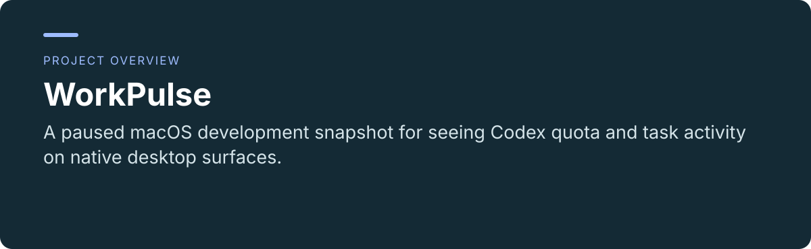
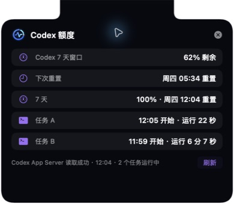
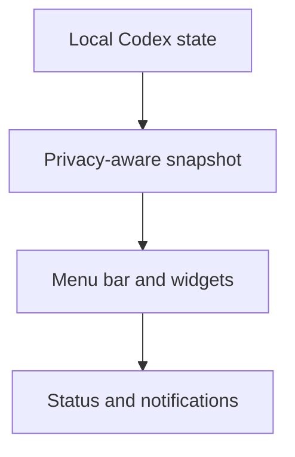

 

# WorkPulse

**A paused macOS development snapshot for seeing Codex quota and task activity on native desktop surfaces.**

[Project usage and maintenance](../README.md) · [Report an issue](https://github.com/thejaytang/WorkPulse/issues)

## 1. What you can do

- Inspect a menu-bar control center, top-of-screen status layer and desktop widgets.
- Study local data boundaries and explicitly recorded validation limits.

## 2. Start here

View the screenshots below, then read the [development guide](../README.md). There is no public end-user installer. Building the native app requires the documented Xcode and signing setup.

## 3. Use cases

These are illustrative scenarios. Only explicitly linked execution artifacts represent checks performed for this update.

| Input or request | Expected result |
|---|---|
| A developer exploring native status UI | Source code and recorded design decisions |
| A portfolio review | Screenshots with a clear paused-development status |

## 4. Requirements and current limits

Development paused. No public installer or notarized distribution is provided. The documented environment is macOS 14+, Swift 6 and full Xcode with an Apple development team for signed widgets. Internal Codex interfaces may change. Historical checks are recorded in the repository; the final real notification click/open acceptance was incomplete. This update does not resume development or revalidate compatibility.

## 5. Documentation and sources

These links identify the implementation, operating instructions or related projects for a closer fit check.

- [Development and current boundaries](../README.md)
- [Native implementation](../native/WorkPulseNative/README.md)
- [Frozen acceptance record](../reviews/final_acceptance_v23_2026-08-13.md)

## 6. License and maintenance

No repository-wide license is declared at the root. This presentation update does not change the terms of code, data or third-party material; confirm permission for the material you want to reuse.

This is the public introduction. Linked project documents remain authoritative for operation, constraints and maintenance. Presentation updated: 2026-09-22.
