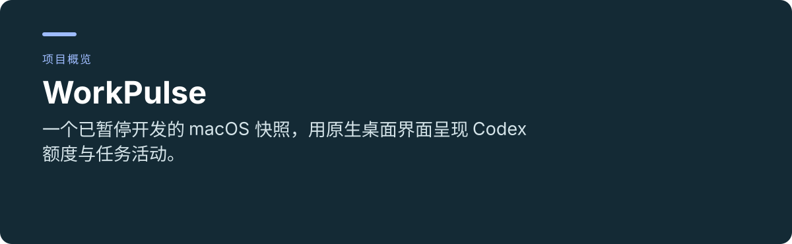
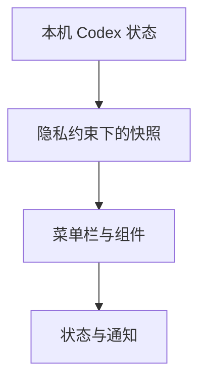

 

# WorkPulse

**一个已暂停开发的 macOS 快照，用原生桌面界面呈现 Codex 额度与任务活动。**

[项目使用与维护入口](../README.md) · [报告问题](https://github.com/thejaytang/WorkPulse/issues)

## 1. 能完成什么

- 查看菜单栏控制中心、屏幕顶部状态层和桌面小组件。
- 研究本地数据边界和明确记录的验证限制。

## 2. 从这里开始

先看下方截图，再读[开发指南](../README.md)。目前没有面向公众的成品安装包；构建原生应用需要文档规定的 Xcode 和签名设置。

## 3. 使用场景

以下为说明性场景；只有明确链接的运行产物才代表本次检查结果。

| 输入或请求 | 预期结果 |
|---|---|
| 研究原生状态界面的开发者 | 源码与记录的设计决定 |
| 作品集浏览 | 附带明确暂停状态的截图 |

## 4. 使用条件与当前边界

开发已暂停，未提供公众安装包或公证发行版本。记录的开发环境为 macOS 14+、Swift 6、完整 Xcode；签名组件需要 Apple 开发团队。本机 Codex 内部接口会变化。历史检查保存在仓库中，最终真实通知点击与打开验收尚未完成。本次更新不恢复开发，也不重新证明兼容性。

## 5. 资料与来源

下面链接指向实现、操作说明或相关项目，便于进一步判断适用性。

- [开发与当前边界](../README.md)
- [原生实现](../native/WorkPulseNative/README.md)
- [冻结验收记录](../reviews/final_acceptance_v23_2026-08-13.md)

## 6. 许可与维护

仓库尚未在根目录声明统一许可证；本次展示更新没有改变代码、数据或第三方材料的许可。复用前请确认对应材料的授权。

本页为对外介绍。具体操作、约束和维护说明以链接的项目文档为准。展示页更新：2026-09-22。
