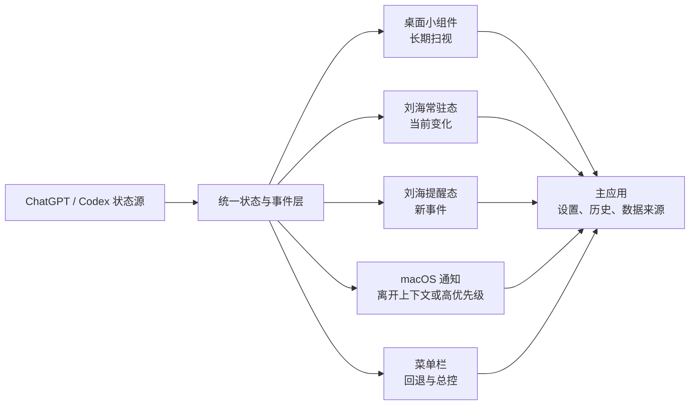

# WorkPulse for ChatGPT 产品需求文档 V1.0

> 工作名：WorkPulse for ChatGPT  
> 文档状态：第一版，可进入产品评审  
> 日期：2026-08-10  
> 平台：macOS，优先 Apple Silicon 及带刘海 MacBook，同时兼容无刘海 Mac 和外接显示器  
> 产品属性：独立的 ChatGPT / Codex 伴侣应用，不修改 ChatGPT 客户端本体

## 1. 产品结论

WorkPulse 不是一个“把 ChatGPT 缩小放到桌面”的工具，也不是又一个集合音乐、天气和剪贴板的刘海工具。它是一层 **AI work continuity layer**，让用户不必反复打开 ChatGPT，也能在 3 秒内回答三个问题：

1. 什么正在运行？
2. 什么正在等我？
3. 当前额度是否适合开启下一项工作？

产品以三类系统表面分工：

- 桌面小组件负责长期、安静、可扫视的信息。
- 刘海状态层负责正在变化的任务，以及刚刚发生、需要注意的事件。
- macOS 通知负责用户不在当前上下文中时，仍不能错过的高价值提醒。

这三类表面必须共享同一个状态模型和去重机制。任何一条事件不能同时在刘海和通知中重复轰炸用户。

## 2. 背景与机会

ChatGPT 桌面端已把 ChatGPT projects、local projects、Chats 与 Sources 放在统一项目视图中，适合持续工作；Scheduled tasks 可以在后台执行，并在桌面端形成需要处理的收件箱式状态。[OpenAI Projects and chats](https://learn.chatgpt.com/docs/projects) [OpenAI Scheduled tasks](https://learn.chatgpt.com/docs/automations)

但用户的关键状态仍分散在项目、线程、Scheduled、通知和额度窗口中。公开竞品已分别验证两类需求：

- 额度类工具，如 [Limit Bar](https://limitbar.artsvit.com/)、[CodexUsageBar](https://codexusagebar.com/) 和 [CodexBar](https://gordonbeeming.com/projects/codex-bar)，解决“用了多少、何时重置”。
- 刘海类工具，如 [Boring Notch](https://github.com/TheBoredTeam/boring.notch) 和 [Notchy](https://notchy.dev/)，验证了音乐、日历、文件架和系统状态可以借助刘海形成轻量入口。

市场空白不是再做一个额度表，也不是再做一个万能刘海工具，而是把“额度、进行中工作、等待输入、完成结果、计划任务和每日简报”组织为一个连续的 AI 工作状态系统。

### 2.1 已观察证据与产品推断

| 类型 | 已观察证据 | 产品推断 |
|---|---|---|
| 官方能力 | Codex **App Server** 提供 `account/rateLimits/read`、额度窗口、已用百分比、重置时间及 usage 数据。[OpenAI App Server](https://learn.chatgpt.com/docs/app-server) | Codex 额度组件可以做成真实数据产品，不必依赖屏幕抓取。剩余百分比由 `100 - usedPercent` 计算，并明确标注更新时间。 |
| 官方能力 | Scheduled 可后台运行，并区分 active、paused、completed 和 recent runs；桌面本地项目的计划任务要求电脑开机且应用运行。[OpenAI Scheduled tasks](https://learn.chatgpt.com/docs/automations) | Scheduled 组件应显示“下次运行、最近结果、是否需要电脑在线”，而不是只显示一个时间。 |
| 平台能力 | macOS 可在桌面或通知中心放置、调整和配置小组件。[Apple Mac User Guide](https://support.apple.com/guide/mac-help/add-and-customize-widgets-mchl52be5da5/26/mac/26) | 小组件适合作为低打扰的长期状态层。 |
| 平台限制 | Apple 当前描述的 Mac **Live Activities** 来自 iPhone，并显示在 Mac 菜单栏；在欧盟，iPhone Mirroring 目前不可用。[Apple Mac User Guide](https://support.apple.com/guide/mac-help/control-your-iphone-from-your-mac-mchl444d53a6/26/mac/26) | Mac-only MVP 不依赖原生 Live Activity，先实现自定义刘海面板和菜单栏回退；iPhone companion 属于后续阶段。 |
| 竞品信号 | 额度工具强调 reset 和 headroom，刘海工具强调随手展开和轻量控制。 | WorkPulse 的差异化必须是“工作何时需要我”，而不是功能数量。 |

说明：竞品公开页面可以证明产品供给和常见功能，不能证明市场规模或使用频率。本版不据此虚构量化需求。

额度边界：当前已确认的官方数据路径覆盖 **Codex App Server 所暴露的 rate limits 与 usage**。它不等于 ChatGPT 所有模型、Deep Research、图片、视频或其他工具的统一总额度。产品 V1 的名称、组件标签和营销文案必须写“Codex 额度”或展示具体窗口名；只有在获得对应官方数据源后，才可以扩展为“ChatGPT 全部额度”。

## 3. 目标、非目标与原则

### 3.1 产品目标

- 用户无需打开 ChatGPT，即可判断当前任务、待处理事项和额度余量。
- 用户从“需要输入”事件到返回正确线程的路径不超过一次点击。
- Daily Brief 在一个视图中解释今天的优先事项、等待决策、Scheduled 结果和额度承载能力。
- 同一事件只选择一个主要提醒表面，其余表面保持状态同步但不重复弹出。
- 所有信息都显示来源和新鲜度，不把缓存、估算或本地判断伪装成实时官方数据。

### 3.2 非目标

- 不在 V1 内复刻完整 ChatGPT 对话界面。
- 不在刘海内完成长文本编辑、复杂提示词输入或文件管理。
- 不加入音乐、天气、剪贴板、相机镜子等通用刘海功能。
- 不绕过 ChatGPT 身份验证，不读取未公开的账号数据，不依赖网页 DOM 抓取作为正式方案。
- 不承诺自动列出全部 ChatGPT 云端 projects、chats 和 Scheduled，除非 OpenAI 提供并允许相应接口。
- 不要求用户为了使用 Mac MVP 而先拥有或安装 iPhone 伴侣应用。

### 3.3 设计原则

1. **Glance first**：先回答状态，再提供操作。
2. **One surface, one job**：小组件用于扫视，刘海用于变化，通知用于打断。
3. **One primary action**：每个提醒最多一个主操作。
4. **Quiet by default**：运行进度不等于需要提醒。
5. **Truth over freshness theater**：显示“5 分钟前更新”，不伪造秒级实时感。
6. **Privacy by omission**：锁屏、共享屏幕或隐私模式默认隐藏任务正文。

## 4. 用户与核心任务

### 4.1 主要用户

同时运行多个 ChatGPT、Work 或 Codex 任务的高频 Mac 用户。他们会把研究、写作、编程或计划任务留在后台，希望在不破坏当前专注的情况下知道何时需要回来。

### 4.2 核心 **Jobs to be Done**

- 当 AI 在后台工作时，我想知道它是否仍在运行，以及是否需要我介入。
- 当我准备启动一项较长任务时，我想知道当前和周期额度是否足够。
- 当 Scheduled 完成或失败时，我想快速判断结果是否值得现在处理。
- 每天开始工作时，我想看到一个可信、简洁的 Brief，而不是重新翻阅多个项目和线程。
- 当我看见提醒时，我想一步返回正确上下文，而不是先打开首页再寻找线程。

## 5. 产品信息架构

### 5.1 表面选择规则

| 用户需求 | 首选表面 | 是否主动打断 | 持续时间 | 典型内容 |
|---|---|---:|---|---|
| 长期扫视 | 小组件 | 否 | 长期 | 额度、Daily Brief、收藏项目、未来计划 |
| 持续进行中的单一状态 | 刘海常驻态 | 否 | 任务运行期间 | 当前任务、运行时长、等待数量 |
| 新发生且短时相关 | 刘海提醒态 | 轻度 | 4 至 8 秒 | 完成、等待输入、额度跨阈值 |
| 用户主动查看细节 | 刘海展开层 | 用户发起 | 直到用户关闭 | 当前任务、下一计划、主操作 |
| 用户已离开或事件严重 | macOS 通知 | 是 | 系统控制 | 失败、长任务完成、等待输入超时 |
| 无刘海或外接屏 | 菜单栏 | 否 | 长期 | 额度、未处理数量、展开入口 |

## 6. 统一状态模型

### 6.1 任务状态

任务状态只描述工作流，不混入额度：

- `idle`：没有活动任务。
- `queued`：等待开始。
- `running`：正在处理，无需用户动作。
- `waiting_input`：需要用户回答、确认或授权。
- `paused`：由用户或系统暂停。
- `completed_unread`：已完成但未查看。
- `completed_read`：已查看。
- `failed`：失败，需要重试或检查。
- `offline`：本地服务或必要应用不可用。
- `stale`：状态来源超过允许的新鲜度阈值。

### 6.2 额度健康度

额度是独立维度，避免“任务正在运行”和“额度较低”互相覆盖：

- `healthy`：剩余大于 20%。
- `watch`：剩余 10% 至 20%。
- `critical`：剩余 1% 至 9%。
- `exhausted`：剩余 0%。
- `unknown`：无数据或数据过期。

默认阈值可调整。跨阈值才产生事件，同一额度窗口内不重复提醒。重置后清除该窗口的提醒记录。

### 6.3 多事件优先级

`failed` / `exhausted` > `waiting_input` > `completed_unread` > `watch` > `running` > `idle`

若同时发生多个事件，刘海只显示最高优先级事件，并用“另有 2 项”表达队列。用户展开后再查看其余事件。

## 7. 形态设计

### 7.1 桌面小组件

Apple 的 **WidgetKit** 支持 small、medium、large 和 extra large。尺寸选择必须改变信息层级，而不是简单放大同一张卡片。[Apple Widgets HIG](https://developer.apple.com/design/human-interface-guidelines/widgets)

#### A. Small：Quota Pulse

**目的**：回答“我现在还能不能开始一项长任务？”

- 主信息：当前最紧张额度窗口的剩余百分比。
- 次信息：该窗口重置倒计时或本地时间。
- 状态信息：数据来源、最后更新时间、是否为计算值。
- 点击：打开菜单栏详情或主应用的 Usage 页面。
- 配置：自动选择最紧张窗口，或固定查看 session / weekly / model-specific window。
- 隐私：不显示任务名。
- 空态：`尚未连接 Codex 使用数据`，主操作“连接”。
- 过期态：数值变灰并显示 `12 分钟前更新`，不继续动画倒计时制造实时错觉。

#### B. Medium：Now & Next

**目的**：回答“现在发生什么，下一步是什么？”

- 左侧：当前最高优先级任务，状态、运行时长或等待时长。
- 右侧：最近一项等待处理 / 下一项 Scheduled / 额度 headroom，三者中只显示最相关的一项。
- 主操作：打开对应线程或项目。
- 次操作：本地“稍后提醒”或“标记已看”。
- 不支持：在组件内输入长回复或直接确认高风险权限。

#### C. Large：Daily Brief

**目的**：在一天开始或中途回顾时，给出可行动的工作摘要。

- 顶部：生成时间、来源覆盖度、是否有过期数据。
- 主区：最多 3 个今日优先事项。
- 决策区：最多 2 个等待用户判断的任务。
- Scheduled 区：最近结果和未来 24 小时计划。
- Usage 区：最紧张窗口和下一次 reset。
- 主操作：打开优先级最高的上下文。
- 次操作：刷新 Brief。若刷新依赖远端工作，显示真实 loading 和失败状态。

#### D. Extra Large：AI Workboard

**目的**：面向重度用户形成完整但可扫视的桌面工作台。

- 四个区域：Active、Needs you、Scheduled、Usage。
- 项目只显示收藏的 3 至 5 个，不展示完整项目树。
- 支持从小组件配置中选择项目集。
- P1 实现。V1 MVP 不用它承载所有功能，以免成为缩小版主应用。

#### 7.1.1 小组件刷新策略

- Widget 读取 App Group 中的共享快照，不直接维持长连接。
- 进度环只表达最近一次可信快照，不显示伪实时 token 流。
- reset 倒计时可根据可信的 `resetsAt` 在本地计算显示；额度百分比只能在新快照到达时改变。
- App 活跃时写入新快照并请求 WidgetKit 刷新；系统最终决定实际刷新时机。[Apple WidgetKit refresh guidance](https://developer.apple.com/documentation/widgetkit/keeping-a-widget-up-to-date)
- 所有尺寸必须包含更新时间或可理解的新鲜度状态。

### 7.2 刘海状态层

#### 7.2.1 两种投放形态，加一个主动展开层

用户提出的两种形态成立，并定义如下：

1. **Resident，常驻紧凑态**：某件事情正在持续发生时停留在刘海区域。
2. **Alert，事件提醒态**：新事件到达时向下短暂弹出，随后收回。

另有 **Expanded，手动展开层**。它不是第三种通知机制，而是用户点击或悬停后主动打开的详情和操作层。

#### 7.2.2 常驻紧凑态

显示条件：存在 `running`、`waiting_input`、`failed` 或未读完成事件，或用户主动开启“始终显示额度”。

- 只显示一个主状态，例如 `正在研究 12:48`、`1 项等你`、`额度 14%`。
- 左侧使用状态图形，右侧显示时间、数量或百分比。
- 点击打开 Expanded。
- 鼠标移入 300 毫秒后可显示轻量预览；不因偶然经过立即大幅展开。
- 无活动且无未读事件时收起到菜单栏图标，默认不常驻一个空壳。
- `waiting_input` 和 `failed` 收回后保留小型标记，直到查看、解决或明确忽略。

#### 7.2.3 事件提醒态

提醒从刘海向下扩展，不改变当前应用焦点：

- 信息型完成事件：显示 4 秒。
- 可行动事件，如等待输入：显示 8 秒。
- 错误或额度耗尽：显示 8 秒，不自动执行任何修复。
- 鼠标进入后暂停倒计时，离开后继续。
- 主操作最多一个，例如“打开任务”“查看结果”“检查额度”。
- 次操作统一为关闭或稍后提醒，不出现三个并列按钮。
- 用户不处理时收回，常驻态保留未读标记。
- 用户正在全屏演示、屏幕共享、开启勿扰或专注模式时，只更新常驻标记，除非用户单独允许关键失败提醒。

#### 7.2.4 手动展开层

- 默认宽度不超过屏幕可用宽度的 36%，高度只容纳 3 个信息区。
- 第一行：当前最高优先级状态和主操作。
- 第二行：额度与重置时间。
- 第三行：下一项 Scheduled 或另有事件数量。
- 用户正在与控件交互时不自动收回。
- 点击外部、按 `Esc` 或再次点击刘海时关闭。
- 支持完整键盘导航和清晰的 `focus-visible`。

#### 7.2.5 无刘海与多显示器

- 无刘海 Mac：同一状态胶囊锚定在当前主显示器菜单栏中央或由用户选择的右侧位置。
- 外接显示器：默认只在当前活动显示器显示 Alert，避免多个屏幕同时弹出。
- 菜单栏图标始终是可达的回退入口，可关闭自定义刘海层而不失去产品能力。

### 7.3 macOS 通知

通知不是刘海提醒的复制品。只有满足以下任一条件才发送：

- 任务失败或额度耗尽。
- `waiting_input` 持续超过 30 秒，且用户未打开 WorkPulse 或对应上下文。
- 运行超过用户阈值的长任务完成，且 ChatGPT / WorkPulse 不在前台。
- Daily Brief 已生成，且用户主动订阅该提醒。

默认不发送：任务开始、常规进度、Scheduled 即将运行、每次额度变化、短任务完成。

通知操作：

- 主操作“打开任务”。
- 可选次操作“1 小时后提醒”。
- “标记已看”只改变 WorkPulse 本地未读状态，不宣称改变 ChatGPT 服务端状态，除非已接入正式同步接口。

通知类别和渠道需要遵循 ChatGPT 与 macOS 的现有设置，不替用户自动开启高优先级通知。[OpenAI Notifications](https://learn.chatgpt.com/docs/notifications)

## 8. 功能需求

### 8.1 Usage / 额度与刷新

**P0**

- 读取可用的额度窗口、`usedPercent`、`windowDurationMins` 和 `resetsAt`。
- 同时存在多个窗口时，默认突出“最接近耗尽”的窗口，并允许切换。
- 显示剩余百分比、重置倒计时和本地绝对时间。
- 20%、10%、0% 三个默认阈值，用户可调整或关闭。
- 阈值提醒在一个窗口周期内只触发一次。
- 数据异常时显示最后成功快照和错误状态，不回退为虚构的 100%。

### 8.2 Active Work / 进行中工作

**P0**

- 支持 `queued`、`running`、`waiting_input`、`completed`、`failed`、`paused`。
- 同时运行多个任务时，按优先级显示一个主任务，并给出总数。
- 记录本地状态变化时间，用于运行时长和等待时长。
- 主操作返回对应上下文；若无可靠 deep link，则打开 ChatGPT 桌面端并复制一个可识别的任务名作为回退，不假装已精准定位。

### 8.3 Pinned Projects & Threads / 收藏项目与线程

**P0 手动收藏，P1 自动同步**

- 用户通过粘贴共享链接、选择本地项目或从伴侣应用添加项目来收藏。
- 每个收藏项包含名称、类型、最近状态、最后活动时间和打开动作。
- Small 不展示项目；Medium 最多 1 个；Large 最多 3 个；Extra Large 最多 5 个。
- OpenAI 官方文档确认 Projects 的产品结构，但当前公开文档未证明第三方伴侣应用可枚举全部云端 Projects / Chats。因此自动同步必须作为待验证能力，不进入 P0 承诺。[OpenAI Projects and chats](https://learn.chatgpt.com/docs/projects)

### 8.4 Scheduled

**P0 本地可见来源，P1 官方同步增强**

- 显示下一次运行时间、是否启用、最近一次结果和是否需要本机在线。
- `completed` 只在结果值得查看时触发 Alert；例行成功仅更新组件。
- `failed` 触发 Alert，并在用户不活跃时升级为通知。
- 支持打开 ChatGPT Scheduled 页面或相应任务上下文。
- 若无法获取 ChatGPT 云端 Scheduled 列表，使用用户手动收藏的 Scheduled 和本地可观察任务，不通过网页抓取绕过边界。

### 8.5 Daily Brief

**P0 本地聚合版，P1 ChatGPT Scheduled 协同版**

Brief 固定回答五件事：

1. 今天最重要的 3 件事。
2. 最多 2 个等待用户判断的问题。
3. 最近完成或失败的 Scheduled。
4. 当前最紧张额度窗口与 reset。
5. 建议的下一工作窗口，例如“额度充足，可开始深度任务”或“建议等待 42 分钟后重置”。

生成规则：

- 只使用已连接、已收藏或用户允许的来源。
- 每条内容保留来源标签，例如 `Codex App Server`、`Local task`、`Pinned link`。
- 数据不完整时显示“覆盖 3/5 个来源”，不把缺失项补写成事实。
- Brief 可由 Scheduled 在固定时间生成；若桌面本地任务要求应用运行，必须在设置中明确说明。

## 9. 事件路由与打扰策略

| 事件 | 刘海常驻 | 刘海弹出 | 系统通知 | 小组件变化 | 默认主操作 |
|---|---:|---:|---:|---:|---|
| 任务开始 | 是 | 否 | 否 | 是 | 打开任务 |
| 常规进度 | 是 | 否 | 否 | 是 | 打开任务 |
| 等待输入 | 是，保留标记 | 是，8 秒 | 30 秒未处理后 | 是 | 回答 / 打开任务 |
| 短任务完成 | 未读时短暂保留 | 是，4 秒 | 否 | 是 | 查看结果 |
| 长任务完成 | 未读时保留 | 是，4 秒 | 用户不活跃时 | 是 | 查看结果 |
| 任务失败 | 是，错误标记 | 是，8 秒 | 是 | 是 | 查看错误 |
| 额度进入 20% | 可选 | 是一次 | 否 | 是 | 查看额度 |
| 额度进入 10% | 是 | 是一次 | 可选 | 是 | 查看额度 |
| 额度耗尽 | 是 | 是一次 | 是 | 是 | 查看重置时间 |
| Daily Brief 完成 | 否 | 用户可选 | 用户订阅时 | 是 | 打开 Brief |
| Scheduled 例行成功 | 否 | 否 | 否 | 是 | 查看结果 |

### 9.1 去重规则

- 每个事件有唯一 `eventId` 和 `dedupeKey`。
- Alert 已被点击，则不再升级为通知。
- 系统通知已送达，刘海只保留状态，不再重复动画。
- 同一额度窗口的同一阈值最多提醒一次。
- 同类事件 60 秒内合并为摘要，例如“3 个任务已完成”。

## 10. 关键交互流程

### 10.1 AI 等待用户输入

1. 状态源发出 `waiting_input`。
2. 统一事件层确认不是重复事件。
3. 刘海弹出 8 秒，显示问题摘要和“打开任务”。
4. 用户点击后打开对应上下文，Alert 消失，状态保持到任务继续运行。
5. 用户未处理，Alert 收回，常驻态显示 `1 项等你`。
6. 30 秒后若用户仍不活跃且允许通知，发送一次 macOS 通知。

### 10.2 额度临界

1. 新快照使剩余额度首次低于用户阈值。
2. 小组件变更状态，刘海弹出一次。
3. 若当前仍有任务运行，文案为“当前任务可继续，暂缓新增长任务”，不制造“现有任务一定失败”的恐慌。
4. 用户查看详情后看到受影响窗口、reset 倒计时和绝对时间。
5. reset 后状态恢复，并清除当前窗口的提醒去重记录。

### 10.3 Daily Brief

1. 计划时间到达，聚合器读取获准来源。
2. 生成结构化 Brief，并记录覆盖度与生成时间。
3. Large / Extra Large 更新。
4. 仅在用户订阅时弹出刘海或系统通知。
5. 用户打开后进入主应用 Brief 页面，可逐项跳转到原始上下文。

## 11. 主应用与设置

主应用只承载不适合塞入刘海或组件的深层任务：

- Overview：当前状态、Needs you、Recent completions。
- Usage：所有额度窗口、reset 和数据来源。
- Pinned：收藏项目、线程和 Scheduled。
- Brief：Daily Brief 历史与来源。
- Notifications：事件级通知策略和阈值。
- Appearance：刘海位置、显示器、透明度、动效和小组件说明。
- Data & Privacy：连接状态、缓存新鲜度、授权和本地数据删除。

菜单栏作为快速控制面：暂停提醒 1 小时、刷新数据、隐藏刘海层、打开主应用、退出。

## 12. 视觉与体验规范

### 12.1 视觉方向

总体风格为“quiet graphite”，接近 macOS 的克制感，而不是高饱和的 AI 渐变：

- 背景：带轻微冷调的 graphite / off-black，支持系统浅色模式。
- 健康：低饱和 mint。
- 信息：system blue。
- 等待注意：amber。
- 失败与耗尽：coral red。
- 颜色不单独承担语义，同时使用图标、标签和文字。
- 字体采用 macOS 系统字体 `SF Pro` / `SF Mono`，数字使用等宽特性以减少跳动。
- 卡片使用系统材质、细边界和有限阴影，不使用装饰性彩虹渐变。

### 12.2 动效

- hover / pressed：150 至 250 毫秒。
- Alert 展开与收回：300 至 420 毫秒。
- 进度变化使用平滑插值，但只在真实数据变更时动画。
- `prefers-reduced-motion` 开启时，取消位移和弹性动画，保留淡入淡出。
- 不闪烁，不使用超过每秒 3 次的状态动画。

### 12.3 可访问性

- 桌面交互目标建议至少 44×44 pt，紧凑刘海内的可点击区域通过透明 hit area 补足。
- 正文对比度至少 4.5:1，非文本控件至少 3:1。
- 所有操作支持键盘，展开层可用 `Esc` 关闭。
- VoiceOver 读取顺序：状态、任务名、时间 / 数量、主操作。
- 不用 hover 作为唯一入口。
- 完整提供 default、hover、active、disabled、focus、loading、empty、error 和 success 状态。

### 12.4 隐私模式

- 默认在锁屏、屏幕共享和演示模式中隐藏任务标题，只显示“1 项需要处理”。
- 用户可选择始终隐藏项目名和线程名。
- 本地缓存不保存对话正文，只保存展示所需的最小元数据和用户主动生成的 Brief。
- 凭证放入 Keychain，不写入小组件共享快照。

## 13. 数据与技术边界

### 13.1 推荐架构

- 原生 macOS 应用：SwiftUI。
- 小组件：WidgetKit，small / medium / large P0，extra large P1。
- 菜单栏：`MenuBarExtra`。
- 刘海层：自定义无边框浮层，根据显示器和菜单栏安全区定位。
- 共享状态：App Group 只存脱敏快照。
- 额度来源：Codex **App Server** adapter。
- 事件统一：本地 event store + dedupe + escalation policy。
- 凭证：Keychain。

### 13.2 接入可信度分级

| 等级 | 含义 | UI 标签 |
|---|---|---|
| Live | 来自已连接的官方或本地事件源 | `实时` |
| Cached | 最近一次可信快照 | `5 分钟前` |
| Derived | 由官方字段计算，如 `100 - usedPercent` | `计算值` |
| Manual | 用户手动收藏或录入 | `手动` |
| Unknown | 无法获取或已过期 | `不可用` |

### 13.3 不可越过的边界

- OpenAI 文档确认功能存在，不等于存在可供第三方应用调用的公开同步 API。
- 若 Projects、Chats 或 Scheduled 无可用接口，V1 使用本地任务、用户收藏和跳转，不进行网页登录抓取。
- 原生 Mac **Live Activities** 的当前公开路径依赖 iPhone；Mac-only 版本使用自定义刘海层，名称和营销文案不能误称为 Apple 官方 Dynamic Island。

## 14. MVP 范围

### 14.1 P0，第一可用版本

- 菜单栏额度与 reset。
- Small Quota、Medium Now & Next、Large Daily Brief。
- 自定义刘海 Resident、Alert 和 Expanded。
- 任务状态统一模型和事件去重。
- 等待输入、完成、失败、额度阈值四类事件。
- 手动收藏项目 / 线程 / Scheduled。
- 本地聚合 Daily Brief。
- 无刘海及外接显示器回退。
- 通知设置、隐私模式、可访问性基础。

### 14.2 P1

- Extra Large AI Workboard。
- 在 OpenAI 提供受支持接口时增强 Projects / Chats / Scheduled 同步。
- 多账号与工作空间区分。
- 更细的额度 pace 指示和历史趋势。
- 可配置的 Brief 模板。

### 14.3 P2

- iPhone companion 和真正的 ActivityKit **Live Activities**。
- 跨设备状态接力。
- 团队共享 Brief 或任务状态，前提是权限和隐私模型成立。

## 15. 功能需求清单

| ID | 优先级 | 需求 | 验收摘要 |
|---|---|---|---|
| FR-01 | P0 | 读取并展示多额度窗口 | 数值、reset、来源、新鲜度完整；无数据不伪造 |
| FR-02 | P0 | 阈值提醒与去重 | 单窗口单阈值只提醒一次，reset 后恢复 |
| FR-03 | P0 | 统一任务状态 | 所有表面同一状态，无相互矛盾 |
| FR-04 | P0 | 刘海 Resident | 仅在活动或未读状态存在时常驻 |
| FR-05 | P0 | 刘海 Alert | 4 / 8 秒规则、hover 暂停、收回保留标记 |
| FR-06 | P0 | 刘海 Expanded | 点击打开、`Esc` 关闭、交互时不自动收回 |
| FR-07 | P0 | Widget 三尺寸 | small / medium / large 信息层级不同 |
| FR-08 | P0 | Daily Brief | 五项固定结构、来源标签、覆盖度和新鲜度 |
| FR-09 | P0 | 手动收藏与跳转 | 用户可添加、编辑、删除和打开收藏项 |
| FR-10 | P0 | 通知升级 | 等待超时、失败、耗尽按策略升级且不重复 |
| FR-11 | P0 | 多显示器回退 | Alert 只在活动屏出现，无刘海时菜单栏可用 |
| FR-12 | P0 | 隐私模式 | 锁屏 / 共享屏幕隐藏敏感标题 |
| FR-13 | P1 | Extra Large | 四区域可配置，不退化为完整主应用 |
| FR-14 | P1 | 官方同步增强 | 仅基于受支持接口进入发布范围 |

## 16. 非功能需求

- 冷启动后 2 秒内展示最近可信快照。
- 活跃任务期间，菜单栏和刘海层在事件源可用时 2 秒内反映状态事件。
- Widget 不承诺秒级刷新，但本地 reset 倒计时不得与 `resetsAt` 偏差超过 1 分钟。
- 断网时仍可查看最后快照、收藏项和 Brief 历史。
- 崩溃恢复后不得重复发送已确认事件。
- 应用空闲时保持低 CPU 与低能耗，不为装饰动画常驻高频刷新。
- 所有状态变化写入最小化本地日志，不记录提示词和完整回复正文。

## 17. 核心验收场景

### AC-01：等待输入不丢失

给定用户在其他应用中工作，当任务进入 `waiting_input`，刘海应在 2 秒内弹出；8 秒未操作后收回并保留标记；30 秒仍未处理且通知获准时只发送一次系统通知；点击任一入口后不再发送重复通知。

### AC-02：额度信息可信

给定两个额度窗口，组件默认突出剩余比例更低者；必须同时显示 reset 倒计时、绝对时间和更新时间；数据超过新鲜度阈值时显示过期状态，不能继续以彩色健康状态呈现。

### AC-03：尺寸有真实差异

Small 只回答额度；Medium 回答 Now & Next；Large 提供结构化 Brief。若三者只是布局缩放，则验收失败。

### AC-04：不重复打扰

同一任务完成事件已通过刘海被查看后，系统通知不得再次出现；一分钟内三个完成事件应合并为一条摘要。

### AC-05：无刘海可用

在无刘海 Mac 或仅使用外接显示器时，用户仍能通过菜单栏查看相同核心状态、打开 Expanded 等价面板并进入目标上下文。

### AC-06：隐私保护

屏幕共享或隐私模式启用时，小组件、刘海和通知均不得显示项目名、线程名或内容摘要，仅显示数量和泛化状态。

## 18. 成功指标

### 18.1 北极星指标

**Action-needed resolution time**：从任务进入 `waiting_input` 到用户打开正确上下文并继续任务的中位时间。

### 18.2 护栏指标

- Missed attention rate：等待输入或失败事件在 30 分钟内未被看到的比例。
- Duplicate interruption rate：同一事件重复打扰的比例，目标低于 1%。
- False freshness rate：UI 显示为实时但来源已过期的比例，目标为 0。
- Notification disable rate：安装 7 天内关闭全部通知的用户比例。
- Resume success rate：点击提醒后成功进入正确上下文的比例。
- Widget utility：不同尺寸 7 日留存及被保留在桌面的比例。

不以“通知发送数量”或“刘海展开次数”作为成功指标，避免激励产品制造打扰。

## 19. 风险与开放问题

| 问题 | 风险 | 当前决策 |
|---|---|---|
| ChatGPT 云端 Projects / Chats / Scheduled 是否有第三方可用接口 | 自动同步可能无法实现 | P0 使用手动收藏、本地来源和明确跳转；接口验证作为发布 gate |
| 精准 deep link 是否稳定 | 点击后可能只能打开 ChatGPT 首页 | 每类入口单独验证；无法精准定位时明确回退行为 |
| 自定义刘海层与全屏、多显示器兼容 | 遮挡菜单或出现在错误屏幕 | 活动显示器策略、菜单栏回退、可完全关闭刘海层 |
| 额度定义会随账号和模型变化 | 用户可能误读不同窗口 | 展示窗口名称、时长、来源，不合并成一个模糊的总额度 |
| Daily Brief 可能把推断写成事实 | 信任受损 | 强制来源标签、覆盖度、缺失提示和跳转原文 |
| 提醒过多 | 用户快速关闭产品 | Quiet by default、跨表面去重、合并事件、可调阈值 |
| App Store 审核与商标表述 | 分发和命名风险 | 使用 companion 定位；不声称是 OpenAI 官方或 Apple 官方 Dynamic Island |

## 20. 发布计划与决策门

### 阶段 A：技术验证

- 验证 `account/rateLimits/read` 与 usage 数据在目标账号上的稳定性。
- 验证任务事件来源、精准跳转和 Scheduled 可见范围。
- 验证带刘海、无刘海、外接屏、全屏和屏幕共享场景。

通过条件：额度可稳定读取；至少一种任务事件源可可靠触发；所有不支持的数据都能优雅降级。

### 阶段 B：交互原型测试

- 使用 5 至 8 名重度 ChatGPT / Codex Mac 用户。
- 测试 Resident 是否打扰、Alert 是否被看见、Expanded 是否能一步到达目标。
- 对比 4 秒 / 8 秒提醒时长，以及 30 秒通知升级阈值。

通过条件：用户能在 5 秒内解释三类表面的职责；重复打扰问题可控；无刘海用户不感到功能残缺。

### 阶段 C：MVP

- 发布 P0 功能。
- 默认只开启等待输入、失败和额度耗尽三类高价值提醒。
- 以本地优先和可解释数据作为发布卖点。

## 21. 第一版产品决策摘要

1. 做独立伴侣应用，但不要求立即上架 Mac App Store；可先用签名测试版或直接分发验证产品。
2. 灵动岛采用“常驻”和“事件弹出”两种投放形态；点击展开只是详情交互层。
3. Mac-only MVP 使用自定义刘海层，不依赖 iPhone Live Activity。
4. 小组件不是同一内容的四种缩放，而是 Quota、Now & Next、Daily Brief 和 Workboard 四级信息结构。
5. P0 的真实优势是额度可信、状态统一和提醒去重；项目与 Scheduled 的全自动云端同步必须先通过接口验证。
6. 视觉保持 macOS 原生、安静、低饱和，拒绝万能工具箱和装饰性 AI 风格。
