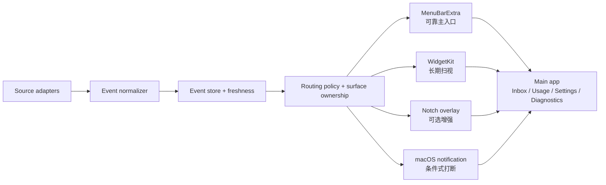

# WorkPulse 产品需求文档 V3.0

> 工作名：WorkPulse  
> 产品副标题：macOS AI Work Companion  
> 文档状态：第三轮团队复审版，可用于 Phase 0 spike、流程原型与可用性测试设计  
> 日期：2026-08-10  
> 平台：macOS 14+，优先 Apple Silicon  
> 首发范围：Codex-first，ChatGPT cloud 能力受官方接口约束  
> 分发策略：Phase 0 / Pilot 使用 Developer ID 签名与 notarized DMG；Mac App Store 另行评估
> 联合复审角色：产品经理、UI/UX 设计师、Apple 技术可行性、用户研究
> 版本关系：本文件取代 V2 作为当前需求基线；第 28 至 37 章是第三轮新增的规范性细化

## 0. 执行摘要

WorkPulse 是 Mac 上的 **AI work continuity layer**。它不复制 ChatGPT 或 Codex 的完整界面，而是在菜单栏、小组件、自定义刘海状态层和系统通知之间，持续回答三个问题：

1. 哪个 AI 工作正在进行？
2. 哪件事正在等待我处理？
3. 当前 Codex 额度窗口还剩多少 headroom，何时 reset？

第三轮新增第四个必须持续回答的问题：WorkPulse 是否仍能可信地观察这些任务？如果监控连接已经丢失，界面必须停止显示虚假 Live，并把系统健康问题与业务事件分开。

V2 的首要产品是 **Needs You 注意力收件箱**，其次才是额度展示。用户最需要的不是更多仪表盘，而是无需轮询就能知道任务完成、失败或等待审批，并能回到正确上下文。公开反馈中，Codex 用户明确描述了长任务超过一分钟、切换窗口后只能反复查看完成状态的问题。[Codex completion notification issue](https://github.com/openai/codex/issues/3962)

V2 不再承诺“自动镜像 ChatGPT 桌面端全部项目、线程和 Scheduled”。OpenAI 官方文档确认 ChatGPT Projects 和 Scheduled 的产品能力，但未提供第三方伴侣应用枚举这些云端对象的公开接口。[OpenAI Projects and chats](https://learn.chatgpt.com/docs/projects) [OpenAI Scheduled tasks](https://learn.chatgpt.com/docs/automations)

V2 采用条件式路线：

- 稳定产品壳：`MenuBarExtra`、WidgetKit、macOS 通知、本地事件库、手动收藏与隐私控制。
- **Technical Preview**：通过受管 `codex app-server` `stdio` 子进程读取额度、usage 和 WorkPulse 可见的 Codex thread 事件。
- 不可承诺能力：自动镜像 ChatGPT cloud、精准打开任意 ChatGPT desktop thread、自动识别所有屏幕共享。
- P2 能力：iPhone companion 与 ActivityKit **Live Activities**，且只用于有明确开始和结束的单个长任务。

最关键的 Go / No-Go 条件是：必须验证 WorkPulse 能否获得可靠的任务事件，并提供可靠的上下文返回路径。若不能，产品不能以“ChatGPT 实时工作伴侣”发布。

## 1. V1 团队复审结论

### 1.1 保留的正确方向

- “小组件长期扫视、刘海表达变化、通知处理高价值打断”的表面分工正确。
- Resident、Alert 两种自动形态，加 Expanded 主动详情层的模型正确。
- 额度与任务状态分离、跨表面去重、显示数据来源和新鲜度的原则正确。
- Mac-only 首版不依赖 iPhone Live Activity 的决策正确。
- 视觉应保持 macOS 原生、低打扰和隐私优先。

### 1.2 V1 必须修正的问题

| 问题 | V1 风险 | V2 决策 |
|---|---|---|
| 首发用户过宽 | 同时服务一般 ChatGPT、Work、Codex、Scheduled 用户 | P0 锁定多任务 Codex 用户，其他用户是后续扩展 |
| MVP 过载 | 同时承诺三种 Widget、刘海、通知、Projects、Scheduled、Brief | P0 只做 Needs You、Quota、Small、Medium、菜单栏和可选刘海 |
| 数据承诺过强 | 把独立 App Server 当成 ChatGPT desktop 实时观察器 | App Server 降为 Technical Preview，并设置跨客户端可见性 Gate |
| 一键返回承诺无依据 | 官方没有公开稳定的 ChatGPT desktop thread deep-link contract | 只对已验证 URL 或 WorkPulse-owned thread 承诺准确返回 |
| Medium 定义不一致 | PRD 写 Now & Next，原型却是额度和项目列表 | Medium 只保留 Current + Next，额度降为辅助 chip |
| 重复打扰 | failed / exhausted 同时触发 Alert 和系统通知 | 引入 **surface ownership**，同一时刻只有一个主动提醒表面 |
| Hover 行为冲突 | 一处 hover 展开，另一处 hover 只预览 | hover 永不打开 Expanded，只高亮或显示 tooltip |
| `stale` 混入任务状态 | 数据可信度和工作流状态混淆 | freshness 独立为第二维度 |
| 隐私能力过度承诺 | 假设可自动检测任何屏幕共享 | P0 使用显式 Privacy Mode；自动检测不作承诺 |
| Daily Brief 证据不足 | 尚未证明用户需要伴侣应用重新生成 Brief | 降为 P1 实验，默认不额外消耗 AI 额度 |

## 2. 产品定位与边界

### 2.1 产品定位

> WorkPulse 是为高频 Codex Mac 用户设计的注意力与额度状态层。它把任务完成、失败、等待处理和 quota headroom 组织为安静、可信、可追溯的系统级体验。

### 2.2 不是这些产品

- 不是完整 Codex client，也不在 V2 内复制对话、终端、diff 和文件审查界面。
- 不是音乐、天气、剪贴板、相机、文件架等万能刘海工具箱。
- 不是 ChatGPT cloud Projects / Scheduled 的非官方同步器。
- 不是精确预测“剩余额度能否完成某项任务”的模型。
- 不是绕过 Focus、通知设置或审批上下文的高优先级提醒器。
- 不是 Apple 官方 Dynamic Island。Mac-only 的刘海层是普通 AppKit 浮层。

### 2.3 产品承诺分级

| 等级 | 定义 | 允许的产品文案 |
|---|---|---|
| Stable | Apple 或本地稳定能力，WorkPulse 可独立保证 | “可用”“支持” |
| Constrained | 能实现，但受系统刷新、权限或来源限制 | “在……条件下可用” |
| Technical Preview | 官方能力存在，但接口或部署仍具有实验性质 | “实验功能”“可能随 Codex 更新变化” |
| Unsupported | 当前无公开接口或无法可靠实现 | 不进入功能承诺 |

### 2.4 与 ChatGPT 官方体验的差异

ChatGPT 已经提供 Activity view、系统通知和任务状态表达，能够展示 unread、running、waiting 等活动信息。WorkPulse 不应把“首次提供后台任务状态”作为差异化。[OpenAI Notifications](https://learn.chatgpt.com/docs/notifications)

WorkPulse 的可验证差异必须集中在：

- 菜单栏、Widget、可选刘海与通知之间的一致状态模型。
- 用户可配置的打扰路由、升级和跨表面去重。
- quota 多窗口、reset、来源与 freshness 的透明表达。
- Needs You 历史、acknowledgement 和本地聚合。
- 在无刘海、外接屏、全屏和 Privacy Mode 中仍保持可达。

若这些差异不能显著减少轮询或缩短上下文返回时间，WorkPulse 就不应仅凭新的视觉外壳发布。

## 3. 用户研究结论

### 3.1 首发用户

多任务 Codex 开发者和 AI Builder：

- 每天有 3 个以上中长时 Codex turns 或 threads。
- 经常在 Codex 运行时切去编辑器、浏览器、终端或另一个项目。
- 遇到 approval、失败、完成和额度窗口切换。
- 使用带刘海 MacBook，也可能接无刘海外接显示器。
- 愿意安装签名 DMG，但要求本地优先、权限透明和低资源占用。

### 3.2 次级用户

- 使用 ChatGPT Projects 的研究、写作和分析用户。
- 使用 Scheduled 生成晨报、周期报告或研究跟踪的用户。
- 高度在意屏幕共享、通知正文和任务名泄露的企业用户。

这些用户不进入 P0 自动同步范围，只用于验证未来需求。

### 3.3 公开证据排名

| 排名 | 用户痛点 | 严重度 | 跨来源频率信号 | 信心 | 产品动作 |
|---|---|---:|---:|---:|---|
| 1 | 后台任务完成、失败或等待审批时只能轮询 | 高 | 高 | 高 | Needs You 成为首要产品 |
| 2 | 收到提醒后仍难回到正确项目或 thread | 高 | 中高 | 中高 | 上下文返回成为 Go / No-Go Gate |
| 3 | quota、reset 与不同表面状态不一致 | 高 | 中高 | 高 | 显示来源、新鲜度和窗口名，不二次解释服务端规则 |
| 4 | Scheduled 是否运行、失败或使用何种连接器不透明 | 高，仅自动化用户 | 中 | 中高 | P1 只做 Scheduled Health，不做完整管理器 |
| 5 | 刘海工具误触、跨屏错位、性能和隐私问题 | 中高 | 中高 | 高 | 菜单栏为主入口，刘海可关闭，默认全屏抑制 |

额度问题的公开案例包括 reset 锚点不确定和 Web / Mac 状态不一致。[Codex quota-window issue](https://github.com/openai/codex/issues/28246) [Codex usage desync issue](https://github.com/openai/codex/issues/23192)

### 3.4 竞品格局与机会边界

| 类型 | 代表产品 | 已覆盖能力 | 用户反馈暴露的问题 | WorkPulse 机会 |
|---|---|---|---|---|
| 额度型 | [CodexIsland](https://github.com/ericjypark/codex-island)、[CodexUsageBar](https://codexusagebar.com/)、[Limit Bar](https://limitbar.artsvit.com/) | 多窗口额度、reset、used / remaining、阈值提醒 | 额度本身容易同质化，无法解决任务等待和上下文返回 | 把 quota 放入工作决策，但明确只做 headroom，不伪装为完成概率 |
| Agent 通知型 | [Notchly](https://github.com/Notchly/Notchly)、[AgentNotch](https://github.com/appgram/agentnotch) | approval、完成提醒、声音、刘海动效 | 新动画不能解决多任务排序、去重和提醒收回后的状态持久化 | Needs You 收件箱、事件优先级、surface ownership、可靠 open target |
| 万能刘海型 | [Boring Notch](https://github.com/TheBoredTeam/boring.notch)、[Perch](https://apps.apple.com/us/app/dynamic-notch-island-perch/id6742724228) | 音乐、天气、日历、文件架、系统状态 | 外接屏、全屏、hover 误触、性能和功能膨胀持续造成体验负担 | 只做 AI work continuity，不进入通用工具箱竞争 |

由此得到三条产品边界：

1. quota 是获客入口，不是充分差异化。
2. 刘海是状态投放表面，不是产品本身。
3. 真正的产品资产是统一事件模型、可信 freshness、打扰路由和上下文返回。

### 3.5 研究边界

- Reddit、GitHub issues 和 App Store reviews 有明显 **self-selection bias**。
- 竞品功能页面证明存在供给，不证明付费意愿或留存。
- Daily Brief 有需求信号，但没有充分证据证明它必须通过 Mac Widget 或刘海消费。
- 尚无公开证据证明大多数用户希望 quota、Projects、Scheduled 和 Brief 全部集成在一个产品中。

## 4. 核心 **Jobs to be Done**

### JTBD-1：停止轮询

当 Codex 在后台运行时，我希望 WorkPulse 在完成、失败或需要我时可靠提醒，让我可以继续当前工作。

### JTBD-2：准确回到上下文

当我收到提醒时，我希望一次操作回到可验证的对应 thread 或 WorkPulse 详情，而不是先打开首页再搜索。

### JTBD-3：理解额度窗口

当我准备开启新的长任务时，我希望看到最紧张额度窗口的 remaining、reset 和数据新鲜度，由我自己决定是否开始。

### JTBD-4：在多屏环境中保持安静

当我全屏、演示、外接显示器或关闭刘海时，我仍能通过菜单栏和必要通知获得同一核心状态。

## 5. 成功定义

### 5.1 北极星指标

**Action-needed resolution time**：从 WorkPulse 获得可确认的 needs-action 事件，到用户打开对应可处理上下文的中位时间。

### 5.2 核心指标

- Context return success rate：主操作进入正确、可处理上下文的比例。
- Missed attention rate：高价值事件 30 分钟内未被看到的比例。
- Duplicate interruption rate：同一事件被两个主动表面重复打扰的比例，目标小于 1%。
- False freshness rate：过期数据被呈现为实时的比例，目标为 0。
- Notification disable rate：安装七天内关闭全部通知的比例。
- Overlay disable rate：安装七天内关闭刘海层的比例，用于判断其真实价值而非作为失败惩罚。
- Widget retention：不同尺寸七日后仍留在桌面的比例。
- Background cost：空闲 CPU、内存与 energy impact。

### 5.3 不使用的成功指标

- 通知发送数量。
- 刘海展开次数。
- Widget 点击次数的单独增长。
- Daily Brief 生成数量。

这些指标会激励产品制造打扰或无意义内容。

## 6. 发布前关键决策门

### Gate A：跨客户端任务可见性，最高优先级

验证独立 `codex app-server` 是否能观察 ChatGPT / Codex desktop 正在运行的目标 threads、状态变化和请求。若只能读取历史或 `notLoaded`，不得宣称实时镜像桌面端。

### Gate B：上下文返回

必须满足以下至少一种：

1. 有官方、稳定的 thread deep link。
2. WorkPulse 管理该 App Server thread，可打开自己的 task detail scene。
3. 用户保存的 URL 可稳定打开对应内容。

若三者均不成立，Needs You 的价值链不闭合，完整 MVP No-Go。

### Gate C：App Server 稳定性

覆盖登录、token refresh、Codex 升级、schema 变化、睡眠唤醒、进程崩溃和多账号。`stdio` 失败时必须进入 `unknown`，不能循环重启或展示旧状态为 Live。

### Gate D：刘海兼容性

通过带刘海、无刘海、双外屏、菜单栏自动隐藏、Spaces、Stage Manager、全屏视频和演示兼容矩阵。若主要场景不稳定，Pilot 默认关闭刘海，仅保留菜单栏。

### Gate E：用户价值

12 名用户完成两周 diary study，其中至少 8 名 Primary persona、6 名多屏用户、4 名高隐私或 Scheduled 用户。通过标准：手动轮询中位数下降至少 30%，有用提醒率至少 80%，至少 8/12 愿意保留菜单栏，并能区分“已看”和“已解决”。

## 7. 产品阶段与范围

### Phase 0：技术与用户验证，不对外承诺生产稳定

优先顺序为 Gate A 跨客户端事件、Gate C App Server 生命周期、Gate B Context return、Gate D Overlay。先完成四个独立 spike，再组合完整视觉产品。

- `AppServerStdioAdapter`、schema、auth 与 reconnect spike。
- Quota、thread status、turn completed / failed、approval 事件验证。
- 不改变 thread ownership 的观察验证。
- 上下文返回 spike。
- Small / Medium Widget 真机刷新验证。
- 菜单栏、通知和可选刘海兼容矩阵。
- 12 名用户原型与 diary study。

### P0：Pilot MVP，Gate A / B / C 通过后

- Needs You 注意力收件箱。
- Quota Headroom。
- `MenuBarExtra` 可靠主入口。
- Small Quota Widget。
- Medium Now & Next Widget。
- 可关闭的 Resident / Alert / Expanded 刘海增强。
- 高价值 macOS 通知与跨表面去重。
- 手动 Privacy Mode、隐藏标题、全局静音和本地数据清除。
- Monitoring Health 与 Diagnostics。
- Pinned manual target，只保存名称、URL 和隐私标签。
- App Server 功能明确标注 Technical Preview。

### P1：Beta

- Large Daily Brief Widget，先做本地聚合版。
- Scheduled Health，仅在获得可信来源后启用。
- Widget 内安全的本地“标记已看”“稍后提醒”。
- quota pace 仅作为明确标注的本地估算。
- 项目范围筛选和全局快捷键自定义。

### P2：条件式扩展

- Extra Large AI Workboard。
- OpenAI 提供正式接口后接入 ChatGPT cloud Projects / Chats / Scheduled。
- iPhone companion 与 ActivityKit Live Activity。
- 跨设备接力和团队状态。

## 8. 信息与状态模型

### 8.1 工作状态

WorkPulse 的 UI 状态必须由来源能力映射，不能假设所有来源都有同一状态：

- `running`：有正在进行的 turn 或工作。
- `needs_approval`：有明确 approval 请求。
- `needs_input`：有明确用户输入请求；实验来源不可用时显示 `unsupported`。
- `completed_unread`：来源报告完成，且 WorkPulse 本地尚未确认已看。
- `failed`：来源报告失败。
- `interrupted`：turn 被中断。
- `idle`：来源在线且无活动任务。
- `not_loaded`：thread 存在，但不在当前 App Server runtime。
- `unknown`：连接中断或证据不足。
- `unsupported`：该来源不提供该状态。

`queued` 和 `paused` 不进入跨来源核心模型，除非具体 adapter 明确支持。

### 8.2 Freshness 独立维度

V3 不再把“多久没有新事件”当作 heartbeat。App Server 没有公开承诺固定 heartbeat，长时间静默也可能是健康的长任务。

- `connectionFreshness`：进程是否存活、初始化是否成功、transport 是否可用。
- `objectFreshness`：对象最近一次由 snapshot 或 source event 验证的时间。
- `lastSourceEventAt`：仅用于诊断，不能自动推断 stalled 或 failed。
- `live`：连接正常，且来源仍报告对象为 active。
- `cached`：使用最近可信快照，仍在允许窗口内。
- `stale`：超过该数据类型的可信阈值。
- `unavailable`：没有成功快照或来源不可用。

规则：

- App Server 连接正常时，静默运行保持 `running` 或 `running_quiet`。
- App Server 断开时，正在运行、等待 approval 或等待 input 的 live 状态在 2 秒内转为 `unknown`，同时保留 `lastKnownState`。
- Quota 在连接、唤醒、网络恢复时刷新，监听 `account/rateLimits/updated`，并使用 5 至 15 分钟兜底读取。
- ManualLink 不拥有自动 freshness；手动 Scheduled 不会自动变成“运行过期”。

### 8.3 额度健康度

- `healthy`：remaining > 20%。
- `watch`：10% < remaining ≤ 20%。
- `critical`：0% < remaining ≤ 10%。
- `exhausted`：remaining = 0%。
- `unknown`：数据不可用或 stale。

阈值是提醒策略，不是任务完成概率。Small Widget 不得写“足以完成长任务”。

### 8.4 事件、投放与解决记录

V3 将不可变的 source fact 与可变的交付状态分开：

```text
NormalizedEvent
  eventID, sourceID, sourceObjectID
  threadID?, turnID?, requestID?
  eventType, severity
  occurredAt, receivedAt
  ownershipMode, privacyClass
  openTargetQuality

DeliveryRecord
  route, state, suppressedReason?
  scheduledAt?, presentedAt?, openedAt?, dismissedAt?
  nextEligibleAt?

AcknowledgementRecord
  acknowledgedAt, acknowledgementSource

ResolutionRecord
  resolvedAt, resolutionSource
```

`surfaceOwner` 不再写进 event；通知也不使用无法保证的单一 `deliveredAt`。`acknowledged` 只表示用户已看到，`resolved` 才表示来源问题解除。

## 9. 产品表面架构



### 9.1 表面职责

| 表面 | 核心问题 | 主动打断 | 可靠性定位 |
|---|---|---:|---|
| 菜单栏 | 全部核心状态与总控 | 否 | P0 主入口 |
| Small Widget | 最紧张 quota window 还有多少 | 否 | P0 |
| Medium Widget | 现在发生什么，下一步是什么 | 否 | P0 |
| Large Widget | 今天最值得关注什么 | 否 | P1 |
| Extra Large Widget | 多任务全局工作台 | 否 | P2 |
| Resident | 一个持续状态 | 否 | 可关闭增强 |
| Alert | 一个新发生的高价值事件 | 轻度 | 可关闭增强 |
| Expanded | 用户主动查看的简要详情 | 用户发起 | 可关闭增强 |
| 系统通知 | 刘海不可达或事件升级 | 是 | P0 |

## 10. Widget 需求

Apple 的 WidgetKit 支持 small、medium、large 和 extra large；Widget 通过 timeline 更新，系统可能晚于请求时间刷新，不能作为秒级实时表面。[WidgetKit timeline](https://developer.apple.com/documentation/widgetkit/timeline) [Apple Widget strategy](https://developer.apple.com/documentation/widgetkit/developing-a-widgetkit-strategy)

### 10.1 Small：Quota Pulse，P0

唯一问题：当前最紧张的 Codex 额度窗口还剩多少？

结构：

1. 窗口名，一行。
2. 28 至 32pt remaining 百分比。
3. reset 倒计时。
4. 仅在异常时显示 `Cached`、`Stale` 或更新时间。

规则：

- 默认选择 remaining 最低的窗口。
- 点击整体打开 Usage scene。
- 不放刷新按钮、图表或第二个操作。
- 无数据时显示“连接后显示 Codex 额度”，不能用 0% 或 100% 占位。
- reset 倒计时可使用 dynamic date；百分比只随新快照变化。

### 10.2 Medium：Now & Next，P0

唯一问题：现在发生什么，下一步需要什么？

布局：56% Current + 44% Next。

Current：

- 一个最高优先级状态。
- 一行 thread 名或隐私化标题。
- 运行、等待或失败时间。
- 最多一个 `另有 N 项`。

Next 只显示以下最高优先级一项：

1. needs approval / input。
2. 最近失败。
3. 最近完成未读。
4. quota critical / exhausted。
5. 无事件时显示本地下一计划。

底部只允许一个辅助 quota chip。P0 最多两个点击区域，不在 Widget 内审批或输入。

### 10.3 Large：Daily Brief，P1 实验

唯一问题：今天最值得关注什么？

结构：

- Header：生成时间和覆盖状态。
- 两行以内 summary。
- 最多 3 个 priorities。
- 最多 2 个 context chips：Needs You、下一计划、Quota 中选择。
- Footer：打开 Brief。

模式：

1. 展示用户已有 Daily Brief 结果。
2. 根据 WorkPulse 已知事件做确定性本地聚合。
3. 用户明确选择后调用 AI 生成，显示会消耗额度。
4. 完全关闭。

默认采用模式 2，不默认额外调用 AI。生成失败时保留上次 Brief，并显示生成时间。

### 10.4 Extra Large：AI Workboard，P2

使用 2×2 网格：

- Active：最多 2 条。
- Needs You：最多 3 条。
- Scheduled：最多 3 条，仅可信来源可用。
- Usage：最多 2 个窗口。

收藏项目只作为数据范围筛选，不成为第五个区块。空模块隐藏，不留下四个空框。

### 10.5 Widget 通用状态

| 状态 | 表现 |
|---|---|
| Initial loading | 静态 skeleton + “正在同步”，不无限旋转 |
| Empty | 说明缺少什么，并提供进入主应用的单一动作 |
| Healthy | 正常内容，不持续显示“实时”徽章 |
| Cached / Stale | 保留最后快照，降低强调度，显示时间 |
| Error | 显示最后快照与“打开诊断” |
| Privacy | 标题替换为数量和泛化状态 |
| Unsupported | “当前来源未提供此数据”，区别于连接错误 |

Widget 可通过 `AppIntent` 执行安全的本地动作，但 P0 不在 Widget 内执行审批、删除、命令或长文本输入。[Apple interactive widgets](https://developer.apple.com/documentation/widgetkit/adding-interactivity-to-widgets-and-live-activities)

## 11. 刘海交互规范

### 11.1 总体原则

- 菜单栏是可靠入口，刘海是可关闭增强。
- hover 永不打开 Expanded。
- 刘海不在无刘海屏幕中央模拟假刘海。
- 默认全屏 suppress Alert。
- 不在刘海中显示完整 prompt、回复、命令或日志。
- 不允许从紧凑表面确认高风险写操作。

### 11.2 Resident

职责：表达一个持续状态。

- 视觉高度 32 至 36pt，透明 hit area 至少 44pt。
- 宽度 220 至 320pt，根据内建刘海 safe area 适配。
- 只显示状态图形、单行标题和一个数字或时间。
- 无活动、无未读且未开启常驻额度时完全隐藏。
- hover 150ms 高亮；标题截断时 500ms 后显示单行 tooltip。
- click、`Enter`、`Space` 或快捷键打开 Expanded。
- Resident 固定在用户选择的显示器，不随鼠标跳屏。

### 11.3 Alert

职责：表达一个新发生的高价值事件，不抢焦点。

- 宽度 360 至 420pt，最多两行文案。
- 普通完成显示 4 秒。
- needs action 显示 8 秒。
- failed / exhausted 显示 10 秒。
- hover 或 VoiceOver 读取时暂停；鼠标离开后至少保留 3 秒。
- 一个主操作，关闭按钮 hit area 至少 44pt。
- 新事件不叠卡；高优先级替换低优先级，其余进入队列。
- 60 秒内同类完成事件合并。
- 单次未展开可见上限 30 秒。

### 11.4 Expanded

职责：用户主动查看的简要详情，不是自动通知。

- 宽度 `clamp(420pt, 34vw, 520pt)`。
- 高度 180 至 360pt，不超过可用屏高 50%。
- 第一层：最高优先级状态和唯一主操作。
- 第二层：quota 和 reset。
- 第三层：下一计划或事件队列。
- 点击 Resident、键盘激活或菜单栏入口打开。
- `Esc`、再次点击 Resident 或点击外部关闭。
- 关闭后焦点返回原触发点。
- 用户交互期间永不自动收回。
- 已展开时的新关键事件只插入顶部状态条，不重启动画。

### 11.5 多显示器与全屏

- Resident 默认固定内建屏，用户可选择其他显示器。
- Alert 只出现一次，优先 key window 所在屏；没有 key window 时使用 Resident 固定屏。Alert 生命周期内不跳屏。
- 无刘海屏只使用右侧 `MenuBarExtra` 和锚定 popover。
- 普通全屏默认不叠加 Alert；全屏本身不会自动把所有权转给系统通知。completed 与 quota critical 只更新 badge。
- 用户可选择“全屏时显示关键失败”，但不能承诺覆盖所有 Spaces 和演示场景。

## 12. 通知与 **surface ownership**

### 12.1 所有权规则

同一事件在任一时刻只有一个主动提醒表面：

1. 当前 target 已在前台：抑制 Alert 与通知，只同步持久状态。
2. 用户在其他窗口、刘海可见且未全屏抑制：Alert 获得所有权。
3. 锁屏、刘海关闭或不可达：对用户已启用的关键事件，系统通知获得所有权。
4. Alert 展示后仍未处理，达到升级阈值且 target 不在前台时，所有权才可转移给通知。
5. 通知已排程或呈现后，返回桌面不得重放 Alert，只在 Resident 保留未解决标记。
6. 点击 Alert、通知或 Expanded 的对应事件后，取消全部待发送升级。

### 12.2 Pilot 默认升级阈值

| 事件 | Alert | 通知升级 | 默认通知级别 |
|---|---:|---:|---|
| needs approval / input | 8 秒 | Alert 后 30 秒且目标不在前台 | `.active` |
| failed work-loss risk | 10 秒 | Alert 后 15 秒且目标不在前台 | `.active` |
| failed recoverable | 8 秒，可关闭 | 默认不升级 | `.passive` |
| turn blocked by quota | 10 秒 | Alert 后 15 秒且目标不在前台 | `.active`，默认无声 |
| 长任务完成 | 4 秒 | 仅用户已开启且任务 ≥60 秒 | `.passive` |
| quota watch / critical | 不主动弹出 | 不升级 | 不发送 |

这些阈值是 Pilot 假设，必须通过用户研究校准。WorkPulse 不把普通失败滥用为 `.timeSensitive`，系统 Focus 和用户设置拥有最终决定权。[Apple notification interruption level](https://developer.apple.com/documentation/usernotifications/unnotificationcontent/interruptionlevel)

### 12.3 通知操作

- 主操作：打开已验证的上下文。
- 次操作：稍后提醒。
- “标记已看”只更新 WorkPulse 本地 acknowledgement，不宣称解决来源问题。
- 不在通知中直接批准命令、权限或文件写入。

## 13. Needs You 注意力收件箱

### 13.1 P0 事件类型

- needs approval。
- needs input，仅当来源明确支持。
- failed，区分 `failed_work_loss_risk` 与 `failed_recoverable`。
- 长任务 completed。
- `turn_blocked_by_quota`，必须有来源明确证明某个 turn 被阻塞。

普通 `quota_exhausted` 只更新 Usage、Widget、MenuBar，默认不进入 Needs You。

### 13.2 每条事件展示

- 来源与 capability label。
- thread / 项目泛化标题。
- 发生时间。
- 严重度。
- 新鲜度。
- 一个主操作。
- 稍后提醒或标记已看。
- 未解决状态。

### 13.3 排序

`needs approval` > `failed work-loss risk` > `turn blocked by quota` > `needs input` > `failed recoverable` > `interrupted` > `completed unread`

同级按发生时间倒序。不同来源无法比较时，不合并成虚假的统一执行进度。

## 14. Quota Headroom

OpenAI 官方 App Server 文档公开 `account/rateLimits/read`、`account/rateLimits/updated` 和 `account/usage/read`，包括 `usedPercent`、`windowDurationMins`、`resetsAt` 和多 bucket。[OpenAI App Server](https://learn.chatgpt.com/docs/app-server)

### 14.1 P0 展示

- 具体窗口名或 `limitId`。
- `remaining = max(0, 100 - usedPercent)`，标记为 Derived。
- used / remaining 切换。
- reset 倒计时与本地绝对时间。
- 来源、最后成功更新时间、freshness。
- watch / critical / exhausted 阈值。

### 14.2 不做

- 不把多个窗口压成一个“ChatGPT 总额度”。
- 不承诺覆盖 Deep Research、图片、视频或所有模型。
- 不根据百分比确定性预测任务一定完成。
- 不默认展示 lifetime token、streak 或复杂图表。
- 不静默消耗 rate-limit reset credit。

### 14.3 数据冲突

若 WorkPulse 数值与 ChatGPT / Codex 官方 UI 不一致：

- 标记 `Source conflict`。
- 显示各自更新时间。
- 不自行选择一个值称为权威。
- 提供诊断信息，不自动刷新轰炸服务。

## 15. Projects、Threads、Scheduled 与 Daily Brief

### 15.1 Codex threads

`thread/list`、`thread/status/changed` 和 `turn/completed` 等方法存在，但只对相应 App Server 可见或管理的 thread 可靠。未加载 thread 可能只有 `notLoaded` 状态。[OpenAI App Server](https://learn.chatgpt.com/docs/app-server)

P0 只展示：

- WorkPulse 确认可见的 thread。
- 由 `sourceKind`、title、cwd 和 runtime status 支持的字段。
- 本地 pin 和 acknowledgement。

### 15.2 ChatGPT Projects / Chats

- P0 仅手动收藏 URL 或名称。
- 手动数据标记 `Manual`。
- 不显示伪造的 running、completed 或 last sync。
- 打开动作只承诺打开已保存 URL 或 ChatGPT 应用回退。

### 15.3 Scheduled Health，P1 条件式

只有获得可信来源时才显示：

- 下次运行时间与时区。
- running / success / partial / failed / offline。
- 最近结果时间。
- 连接器或来源健康度。
- 结果入口。

未获得接口时只允许用户保存一个计划入口和自定义时间，不能称为“同步状态”。

### 15.4 Daily Brief，P1 实验

Brief 最多包含：

- 3 个 priorities。
- 2 个 Needs You。
- 最近失败或完成事件。
- 最紧张 quota window。
- 所有条目可追溯到来源。

默认使用确定性本地聚合，不默认调用 AI。若用户选择 AI 生成，必须先说明数据范围、额外额度消耗和失败回退。

## 16. 主应用与 Onboarding

### 16.1 主应用导航

最多五个一级入口：

1. Inbox。
2. Usage。
3. Brief，P1。
4. Pinned。
5. Settings & Diagnostics。

### 16.2 Onboarding

Step 1，产品边界：

- 说明 WorkPulse 不是 OpenAI 官方应用。
- 说明首发只覆盖 Codex 可见数据和本地收藏。

Step 2，连接：

- 检测本机 Codex。
- 解释 App Server Technical Preview。
- 不复制 `auth.json` 或导出 token。

Step 3，选择表面：

- 菜单栏默认开启。
- Small / Medium Widget 由用户随后添加。
- 刘海层先展示交互预览，由用户主动开启；Pilot 默认关闭。

Step 4，通知：

- 在用户选择需要提醒的事件后再请求通知权限。
- 默认启用 approval、重大 failed、turn blocked by quota 和明确 needs input；普通 quota exhausted 不进入 Needs You。

Step 5，隐私：

- Widget 与通知始终使用泛化标题；Overlay 中的 thread 标题默认关闭，由用户主动开启。
- Privacy Mode 快捷键。
- 全屏时是否显示关键失败。

### 16.3 Settings & Diagnostics

- 数据来源与 capability 状态。
- 最近成功同步时间。
- App Server 版本与连接状态。
- CPU / energy 诊断。
- 通知队列和最近去重结果。
- 暂停采集、全局静音、清除本地数据。
- 导出脱敏诊断，不含 prompt 和正文。

## 17. 隐私、安全与权限

- 默认不写入 prompt、完整 assistant message、命令正文或文件内容。
- App Group 只存 Widget 所需的脱敏快照。
- WorkPulse 不复制 Codex token；认证由 Codex 进程处理。
- Widget snapshot 与通知正文默认使用泛化内容，不存 task title、prompt、文件路径或命令。Privacy Mode 主要控制 MenuBar、Resident、Alert、Expanded 和应用内预览。
- WidgetKit 刷新由系统调度，已展示通知也可能存在处理延迟，因此不承诺 Privacy Mode 能瞬时替换这些系统表面。
- 自动屏幕共享检测不进入承诺。用户使用快捷键、菜单栏或设置切换 Privacy Mode。
- 可选会议应用 heuristic 必须标记“可能不完整”。
- 锁屏或通知预览受限时使用泛化文案，如“1 项任务需要处理”。
- 高风险 approval 必须打开完整上下文，不能在 Widget、Alert 或通知内直接确认。
- 不静默修改用户现有 Codex `notify` 配置。
- P0 不申请 Full Disk Access、Accessibility、Screen Recording、Camera、Microphone 或 Location。

## 18. 视觉设计系统

### 18.1 视觉方向

**Quiet graphite**：低饱和、无装饰性 AI 渐变、依赖 macOS 自适应材质和语义颜色。

语义 token：

- `surface.base`：窗口基础背景。
- `surface.raised`：Expanded / popover。
- `text.primary`、`text.secondary`、`text.tertiary`。
- `status.healthy`、`status.attention`、`status.critical`、`status.info`。
- `focus.ring`。

深色探索值可从现有原型的 graphite 系统继续，但最终颜色必须通过对比度测试；浅色模式使用 Asset Catalog 动态颜色，不直接反转深色值。

### 18.2 排版

- `SF Pro Text` 为主，数字使用 monospaced digits。
- `SF Mono` 只用于 source、状态码或技术字段。
- Widget hero：28 至 32pt。
- Expanded 标题：15pt semibold。
- 行标题：12 至 13pt semibold。
- 正文：12pt。
- metadata：不低于 11pt。
- 正式产品删除现有原型中 9 至 10px 正文。

### 18.3 间距与形状

- 4pt 网格：4 / 8 / 12 / 16 / 24 / 32。
- Widget 遵循系统 content margins。
- 小卡圆角 10 至 12pt。
- 浮层区块 16pt。
- Expanded 外层 22 至 24pt。
- 不使用持续光晕、呼吸点或与状态无关的阴影。

### 18.4 动效

- hover / pressed：120 至 180ms。
- Alert 进入：220 至 280ms。
- Alert 收回：180 至 220ms。
- Expanded：260 至 320ms。
- 低回弹，无明显 overshoot。
- Reduce Motion 下取消位移、缩放和弹性，仅保留约 100ms crossfade。
- Reduce Transparency 下使用不透明 surface 和清晰边界。

## 19. Accessibility

- 普通文字对比度至少 4.5:1；控件、图标和 focus ring 至少 3:1。
- hit area 至少 44×44pt。
- 状态通过图标、文字、颜色中的至少两种表达。
- 无 hover-only 功能。
- Alert 不抢焦点；普通完成不强制 VoiceOver announcement。
- Expanded 支持完整键盘操作，`Esc` 关闭并回到触发点。
- 系统文字放大至 130% 时，主操作不得裁切，辅助信息可优先隐藏。
- 支持 Increase Contrast、Reduce Motion、Reduce Transparency 和 Differentiate Without Color。
- 以真实中英文长标题测试，不按固定字符宽度设计。

## 20. 技术可行性矩阵

| 能力 | 结论 | V2 处理 |
|---|---|---|
| 四种 macOS Widget | Supported | Small / Medium P0，Large P1，Extra Large P2 |
| Widget AppIntent / Link | Supported with constraint | 只做安全本地动作和 scene 打开 |
| Widget 秒级状态 | Unsupported | 使用快照、timeline 和 freshness |
| MenuBarExtra | Supported | P0 可靠主入口 |
| 自定义刘海 NSPanel | Supported with constraint | 可关闭，不能称为系统 Dynamic Island |
| 所有全屏 / Spaces 可靠覆盖 | Prototype-only | 默认全屏抑制，真机矩阵验证 |
| macOS 通知 actions / 去重 | Supported | P0 |
| 自动检测所有屏幕共享 | Unsupported | 显式 Privacy Mode |
| Mac-only ActivityKit Live Activity | Unsupported | P2 需要 iPhone companion |
| iPhone Live Activity 显示到 Mac | Supported with constraint | macOS Tahoe 26+、配对和地区限制 |
| App Server quota / usage | Technical Preview | `stdio` spike，capability gate |
| App Server thread / turn events | Technical Preview | 仅对可验证可见 threads |
| App Server WebSocket | 不进入 MVP | 不开放端口 |
| ChatGPT cloud Projects 枚举 | Unsupported | 手动收藏 |
| ChatGPT Scheduled 自动同步 | Unsupported | P1 仅可信 adapter |
| 任意 ChatGPT desktop thread deep link | Unsupported as promise | Gate B |

Apple 说明 Live Activities 从 iPhone / iPad 开始，并在配对 Mac 菜单栏显示 compact、minimal 和 expanded 形态；它不是 Mac-only 自定义刘海的实现路径。[Apple Live Activities HIG](https://developer.apple.com/design/human-interface-guidelines/live-activities)

## 21. 推荐技术架构

```text
SwiftUI App
├── MenuBarExtra
├── MainWindow
├── AppKit OverlayCoordinator
├── Widget Extension
├── NotificationCoordinator
├── SnapshotStore            App Group，脱敏
├── EventStore               SQLite WAL，主应用独占读写
├── EventNormalizer
├── RoutingPolicy
└── SourceAdapter
    ├── ManualLinkAdapter            Stable
    ├── CodexNotifyAdapter           Constrained
    ├── AppServerStdioAdapter        Technical Preview
    └── ChatGPTCloudAdapter          Not available
```

### 21.1 AppServerStdioAdapter 约束

- 仅启动受管 `codex app-server --listen stdio://` 子进程，不开放 WebSocket 端口。
- 每次连接执行 `initialize`，记录 Codex 版本和 capability。
- `clientInfo` 使用真实 WorkPulse name/version，不伪装官方客户端。
- `experimentalApi` 默认关闭；`tool/requestUserInput` 等实验能力独立 gate。
- 不假设 schema 永久不变。
- 指数退避重启，超过阈值进入 `unknown`。
- 最小订阅，不保存 prompt 和完整回复。
- 不读取或复制认证文件。
- 不自动 `thread/resume` 外部 thread，不调用 `thread/delete`、`turn/start` 或配置写入等副作用方法。
- 显式指定经过验证的 `sourceKinds`。
- 设置中永久显示 Experimental 标签。

### 21.2 Widget 数据路径

- 主应用 / adapter 写入 EventStore。
- Normalizer 生成脱敏 Snapshot。
- App Group 使用原子替换保存 generic Snapshot，包含 `schemaVersion`、`generatedAt`、`freshUntil`、`privacyClass`，不保存凭证、标题和正文。
- Widget 读取 Snapshot 并请求 timeline。
- reset 时间可本地动态显示，额度值只由新 Snapshot 更新。
- Widget 不启动 Codex、不连接 App Server、不打开 EventStore。

## 22. 功能需求

| ID | 优先级 | 需求 | 能力门 |
|---|---|---|---|
| FR-01 | Phase 0 | 验证 App Server 跨客户端可见性 | Gate A |
| FR-02 | Phase 0 | 验证稳定上下文返回 | Gate B |
| FR-03 | Phase 0 | 验证 App Server 生命周期、schema、auth 与重连 | Gate C |
| FR-04 | Phase 0 | 验证 Overlay 多屏、全屏与 Accessibility | Gate D |
| FR-05 | P0 | Needs You 事件库与 acknowledged/resolved/snoozed 生命周期 | Gate A/B/C |
| FR-06 | P0 | foreground-context suppression | verified target |
| FR-07 | P0 | transactional delivery ledger、dedupe、watermark 与升级 | Stable local |
| FR-08 | P0 | Monitoring Health、unknown 与恢复 reconcile | Gate C |
| FR-09 | P0 | quota 多窗口、remaining、reset、freshness | App Server Preview |
| FR-10 | P0 | MenuBarExtra 总控、键盘与回退 | Stable |
| FR-11 | P0 | Small Quota Widget | quota source |
| FR-12 | P0 | Medium Now & Next Widget | task source |
| FR-13 | P0 | Resident / Alert / Expanded | Gate D |
| FR-14 | P0 | macOS actionable notifications 与 snooze | notification permission |
| FR-15 | P0 | Pinned manual targets | Stable local |
| FR-16 | P0 | generic snapshot、Privacy Mode 与本地数据清除 | Stable local |
| FR-17 | P0 | Settings & Diagnostics | Stable local |
| FR-18 | P1 | Large Local Brief | local event coverage |
| FR-19 | P1 | Scheduled Health | trustworthy adapter |
| FR-20 | P1 | quota pace | validated estimate |
| FR-21 | P2 | Extra Large AI Workboard | stable multi-source data |
| FR-22 | P2 | ChatGPT cloud sync | official supported API |
| FR-23 | P2 | iPhone Live Activity | iPhone companion |

## 23. 非功能需求

- 对当前受管 App Server thread，事件到菜单栏 / Alert 的目标延迟小于 2 秒；不适用于 Widget 或 ChatGPT cloud。
- 冷启动 2 秒内展示最近可信 Snapshot，并明确 Cached。
- Widget 不承诺秒级刷新。
- 断网和 adapter 崩溃后继续显示最后快照，但必须按阈值转为 Stale。
- 重启后不得重复发送 acknowledged 事件。
- 空闲状态不运行动画或高频轮询。
- 不记录 prompt、完整 assistant response 和文件内容。
- Phase 0 必须记录 CPU、内存、energy impact 和 adapter 重启次数。
- Schema 不兼容时关闭相应 capability，不让整个应用崩溃。

## 24. 验收标准

### 产品与数据

- **AC-P01**：没有可靠事件源时，不显示 running / completed 等伪状态。
- **AC-P02**：任一数值可查看 source、更新时间和 freshness。
- **AC-P03**：ChatGPT 手动收藏项不显示自动状态。
- **AC-P04**：上下文返回只对通过 Gate B 的目标标记“打开任务”。
- **AC-P05**：App Server 断开后 2 秒内相关 live 任务转为 unknown，并保留 lastKnownState。

### Widget

- **AC-W-P0-01**：Small 与 Medium 分别回答 quota 和 Now & Next，不重复职责。
- **AC-W-P0-02**：Small 与 Medium 具备 loading、empty、healthy、cached、stale、offline、error、privacy、unsupported。
- **AC-W-P1-01**：Large 进入 P1 后单独验收 Daily Brief。
- **AC-W-P2-01**：Extra Large 进入 P2 后单独验收 Workboard。
- **AC-W03**：Small 在 3 秒内可识别 remaining 与 reset。
- **AC-W04**：Medium 最多两个点击区域，不重复同一事件。
- **AC-W05**：Widget 中不存在审批、删除或高风险写操作。

### 刘海与通知

- **AC-N01**：hover 不打开 Expanded；点击和键盘激活等价。
- **AC-N02**：Alert 遵循 4 / 8 / 10 秒规则；Accessibility 或键盘焦点位于 Alert 内时不自动消失。
- **AC-N03**：Alert 不抢焦点；Expanded 交互时不自动关闭。
- **AC-N04**：同一事件同一时刻只有一个主动提醒表面。
- **AC-N05**：通知送达后返回桌面不重放 Alert。
- **AC-N06**：双显示器同一 Alert 只出现一次，Resident 不随鼠标跳屏。
- **AC-N07**：无刘海、刘海关闭和全屏抑制时，菜单栏仍可到达核心状态。

### 隐私与 Accessibility

- **AC-PR01**：Widget 与通知默认 generic；Privacy Mode 在 1 秒内脱敏 MenuBar、Overlay 与应用预览，不承诺系统瞬时替换已显示 Widget/通知。
- **AC-PR02**：本地清除后 Snapshot、EventStore 和 Brief 历史均删除，认证仍由 Codex 管理。
- **AC-A01**：正文对比度至少 4.5:1，控件至少 3:1。
- **AC-A02**：仅用键盘和 VoiceOver 可完成展开、浏览、打开和关闭。
- **AC-A03**：Reduce Motion 下没有位移、缩放、弹性和持续脉冲。
- **AC-A04**：130% 文字缩放下主操作不裁切。

## 25. Phase 0 测试计划

### 25.1 技术 spikes

1. App Server 跨客户端可见性。
2. `stdio` 版本、schema、重连和认证。
3. Codex `notify` 共存，不覆盖用户配置。
4. Widget 真机 reload 与 dynamic date。
5. Overlay 多显示器、全屏和辅助功能矩阵。
6. Deep-link / open target。
7. Developer ID + notarization 与 Mac App Store sandbox 差异。

### 25.2 用户研究

对象：12 名首发用户，至少覆盖 8 名 Primary persona、6 名多屏用户和 4 名高隐私或 Scheduled 用户：

- 内建刘海屏为主。
- 长期外接显示器。
- 经常全屏 / 演示。
- 高隐私要求。

任务：

- 让两个 Codex 任务后台运行并处理一次 approval。
- 识别一个失败和一个完成事件。
- 根据 quota window 决定是否启动下一任务。
- 在双屏、全屏和 Privacy Mode 中完成相同流程。

关键问题：

- 用户最不能错过的是 approval、失败还是完成？
- “长任务”阈值应是 30 秒、60 秒还是自定义？
- 用户是否保留 Resident？
- quota 的价值是安排工作还是缓解焦虑？
- Daily Brief 是否值得额外消耗额度？
- 用户接受签名 DMG 还是要求 Mac App Store？

## 26. 风险与应对

| 风险 | 影响 | 应对 |
|---|---|---|
| App Server 改版或不可生产依赖 | 核心数据失效 | Technical Preview、capability gate、schema 协商 |
| 无法观察 desktop 实时任务 | 产品承诺不成立 | Gate A；失败则不发布完整 companion |
| 无稳定 deep link | 提醒后仍需寻找 thread | Gate B；改用 WorkPulse-owned scene 或降级文案 |
| quota 来源冲突 | 信任受损 | 并列来源与更新时间，不自称权威 |
| 刘海跨屏 / 全屏问题 | 遮挡或误触 | 菜单栏为主、刘海可关闭、默认全屏抑制 |
| 通知过多 | 用户关闭全部通知 | surface ownership、合并和可调升级 |
| 隐私泄露 | 高严重度 | 最小数据、手动 Privacy Mode、泛化通知正文 |
| MVP 被 Daily Brief 拖大 | 延迟验证核心价值 | Large / Brief 降为 P1 |
| App Store sandbox 限制 | 分发受阻 | 先 Developer ID + notarized DMG，商店版单独架构 |

## 27. 第二轮决策记录

本章保留 V2 决策历史；如与第 28 至 40 章冲突，以第三轮规范为准。

1. WorkPulse 首发是 Codex-first 的 macOS 状态伴侣，不再称为 ChatGPT 全量实时伴侣。
2. 核心价值从“展示更多信息”调整为“Needs You + 可靠上下文返回 + quota truth”。
3. `MenuBarExtra` 是 P0 主入口；自定义刘海是可关闭的体验增强。
4. Resident 和 Alert 是两种自动投放形态；Expanded 仅由用户主动打开。
5. hover 永不展开 Expanded。
6. 同一事件只有一个主动提醒表面，系统通知只在不可达或升级时接管。
7. Small / Medium 进入 P0；Large Daily Brief 进入 P1；Extra Large 进入 P2。
8. ChatGPT Projects、Chats、Scheduled 自动同步必须等待正式支持接口。
9. Mac-only 不使用原生 ActivityKit；iPhone Live Activity 只用于有起止的长任务。
10. App Server 全部能力标记 Technical Preview，并受 Gate A / B / C 控制。
11. 自动检测所有屏幕共享不进入承诺，改用显式 Privacy Mode。
12. Phase 0 通过后才进入 Pilot MVP；若任务可见性和上下文返回失败，不发布被削弱成普通 quota tracker 的版本。

## 28. 第三轮需求追踪矩阵

| 用户痛点 | JTBD | P0 能力 | 主要表面 | 核心指标 | Gate |
|---|---|---|---|---|---|
| 后台任务只能反复检查 | 停止轮询 | Needs You、long completion | Alert、MenuBar、Inbox | manual polling reduction | A/C/E |
| 提醒后找不到任务 | 返回上下文 | verified open target、fallback detail | Alert、Notification、Inbox | context return success | B |
| approval 被误认为仍在运行 | 解除阻塞 | persistent unresolved state | Alert、Resident、Inbox | approval seen in 5 min | A/B |
| quota 与 reset 不透明 | 安排下一任务 | bucket、remaining、reset、freshness | Small、MenuBar、Usage | quota decision changed | C/E |
| 断线后仍显示 running | 建立信任 | monitoring lost、unknown、reconcile | MenuBar、Resident、Diagnostics | false live rate | C |
| 刘海重复打扰或错屏 | 保持专注 | surface ownership、suppression | Overlay、Notification | duplicate/disable rate | D/E |
| 锁屏或共享时泄露标题 | 保护隐私 | generic external surfaces | Widget、Notification、Overlay | sensitive leak count | D/E |

任何 P0 功能必须至少映射一个 JTBD、一个指标和一个 Gate；没有映射的功能不能进入 Pilot。

## 29. 事件与提醒生命周期

### 29.1 统一业务优先级

`needs_approval > failed_work_loss_risk > turn_blocked_by_quota > needs_input > failed_recoverable > interrupted > completed_unread > quota_exhausted > quota_critical > running`

`monitoring_lost` 属于 System Health，固定置顶，不与业务优先级竞争。

### 29.2 生命周期

```text
Action-blocking:
observed → eligible → routed → presented → acknowledged → resolved → archived
                       ↘ suppressed
                       ↘ snoozed → eligible

Completion:
completed_unread → completed_seen → archived
```

- Alert 超时收回不等于 acknowledged。
- OS 接受 URL 请求或 WorkPulse detail scene 成功打开后，才可记录 acknowledged。
- 打开失败保持未读与 unresolved。
- source 报告 request resolved、turn 继续或问题被新的可信 transition 替代后，才记录 resolved。
- Snooze 只更新 `nextEligibleAt`，不创建重复 event。

### 29.3 Dedupe 与 watermark

首选 dedupe key：`sourceID + sourceObjectID + turnID/requestID + eventType + sourceTransitionID`。

- 无稳定上游 ID 时才使用 60 秒 fallback。
- 首次同步和重连建立 `subscriptionWatermark`。
- watermark 前的 terminal event 进入 History，但不触发 Alert 或 Notification。
- 同一 pending notification 使用稳定 request identifier 替换，不重复排队。

## 30. Surface ownership 与抑制规则

### 30.1 路由顺序

1. 验证 event 是否 fresh、可信且位于 watermark 后。
2. 判断是否 action-blocking 或 awareness。
3. 检查目标上下文是否已在前台。
4. 检查 snooze、mute、Privacy 与用户设置。
5. 检查 Overlay 可达性、全屏、锁屏与显示器状态。
6. 选择一个主动表面，并以 SQLite 单事务写入 DeliveryRecord。

### 30.2 Foreground-context suppression

- 当前前台 target 与 event target 匹配时，不显示 Alert、不发送通知。
- 只更新来源上下文、MenuBar badge 和 Inbox。
- 用户未离开目标上下文时，不因 30 秒超时自动升级。
- P0 不通过全局键盘、鼠标或 Accessibility 监听推断用户活跃。

### 30.3 全屏

- 全屏不会自动把 Overlay 事件改送系统通知。
- completed、quota watch/critical 只更新 badge。
- needs approval 和重大失败只有用户开启“全屏关键提醒”时才通知。
- Focus 与系统通知设置拥有最终决定权。

### 30.4 默认投放矩阵

| 事件 | 前台同目标 | 用户在其他窗口 | 锁屏/Overlay 不可达 | 持久状态 |
|---|---|---|---|---|
| needs approval | suppress | Alert 8 秒 | active notification | unresolved |
| major failure | suppress | Alert 10 秒 | active notification | unresolved |
| turn blocked by quota | suppress | Alert 10 秒 | active notification，无声 | unresolved |
| needs input | suppress | Alert 8 秒 | active notification，无声 | unresolved |
| long completion | 当前界面内更新 | Alert 4 秒，受阈值控制 | passive，仅用户开启 | unread |
| quota critical | Usage 更新 | Resident/Widget | 不通知 | 无 |
| monitoring lost | 当前界面内警告 | 单次 Alert | passive，可配置 | System Health |

## 31. 七条端到端流程

### Flow 1：首次连接

1. 展示无权限模拟事件和产品边界。
2. 用户选择连接 Codex，系统显示 executable 最终路径与版本。
3. `spawning → initializing → account read → capability smoke test`。
4. 按 Quota、Thread events、Approval、Input、Open target 分项显示 Stable、Preview、Unsupported。
5. 用户选择需要提醒的事件后才请求系统通知权限。
6. 显示 Overlay 预览，默认可跳过。
7. 设置标题可见性和 Privacy 快捷键，进入 Inbox。

失败时保留 Diagnostics 与重试，不能用总体“连接失败”掩盖具体 capability。

### Flow 2：Approval

1. Adapter 接收 approval request。
2. Normalizer 检查 freshness、dedupe、ownership、open target。
3. 前台同 target 则 suppress；否则路由 Alert 或 Notification。
4. 用户点击“打开审批”，按钮进入 `opening` 并禁止重复点击。
5. 精确打开成功后 acknowledged，仍 unresolved。
6. 来源报告 request resolved 或 turn 继续后 resolved。
7. 打开失败则进入 WorkPulse 详情，显示“该提醒仍未解决”。

### Flow 3：失败与 Snooze

1. 区分重大失败和可恢复失败。
2. 用户可选 15 分钟、1 小时或明天提醒。
3. Snooze 期间不重复 Alert/Notification，但 Inbox 保留并显示到期时间。
4. 新的 running/completed transition 才解除失败 unresolved。

### Flow 4：长任务完成

- `<30s`：不主动提醒。
- `30–60s`：仅用户已离开目标时显示 Alert。
- `≥60s`：用户离开时 Alert；用户不活跃且主动开启完成通知时可 passive Notification。
- Approval、input、重大失败不受长任务阈值限制。

### Flow 5：Quota 跨阈值

1. 只接受 fresh snapshot。
2. 第一次跨过 watch、critical 或 exhausted 时更新 Small、MenuBar、Usage。
3. stale snapshot 不生成事件。
4. reset 后清除 bucket 当前周期 dedupe。
5. 只有明确 turn error/blocked signal 生成 `turn_blocked_by_quota`。

### Flow 6：Monitoring lost

1. App Server EOF、进程退出、schema incompatible 或必要 capability 失效。
2. live objects 在 2 秒内转 unknown，保留 lastKnownState。
3. MenuBar System Health 置顶，Resident 不再显示“正在运行”。
4. 有活动任务时最多提示一次 monitoring lost。
5. 有界重连；恢复后 reconcile，不补播旧 Alert。

### Flow 7：Privacy 与多屏

1. Widget snapshot 和通知从创建时即 generic。
2. Privacy Mode 在 1 秒内脱敏 MenuBar、Overlay 和主应用预览。
3. Resident 固定用户选择屏，不跟随鼠标。
4. Alert 优先 key window 屏，无 key window 时使用 Resident 屏。
5. Alert 生命周期内不跳屏；目标屏断开时关闭 Overlay 并回退 MenuBar。

## 32. MenuBarExtra 组件规范

### 32.1 状态项

- 18×18pt SF Symbol。
- Needs You badge 为 1 至 9，超过显示 `9+`。
- 默认不常驻显示 quota 百分比。
- Tooltip：`WorkPulse：2 项需要处理，Codex 剩余 14%`。
- 优先级：monitoring lost > approval > failed > input > blocked quota > completed > running > idle。

### 32.2 Popover

宽度 360 至 400pt，高度上限 520pt：

1. Header：WorkPulse、Privacy、静音状态。
2. System Health，仅异常时出现。
3. Needs You，最多 3 条，每条一个主操作。
4. Active，最多 1 条。
5. Quota，最紧张窗口。
6. Footer：Inbox、Settings / Diagnostics。

没有待处理时显示“目前没有需要处理的任务”，不渲染空列表。键盘打开后焦点进入第一条可操作项；上下箭头移动，`Enter` 打开，`Esc` 关闭并返回状态项。

## 33. 主应用组件规范

使用 `NavigationSplitView`，最小窗口 760×520pt。

### Inbox

- 分区：Needs action、Seen、History。
- 列表行：severity、泛化或用户允许的 title、source、时间、freshness、unread/unresolved/snoozed。
- 详情：事件摘要、source、open target quality、主操作、snooze、标记已看、诊断入口。
- completed 不与 unresolved failure 永久混排。

### Usage

每个 bucket 显示名称、remaining/used、reset 倒计时与绝对时间、更新时间、source、freshness 和 source conflict。

### Pinned

P0 只保存名称、URL、隐私标签，标记 `Manual`，不显示自动 running/completed/last sync。

### Settings 与 Diagnostics

日常设置与实验诊断视觉分组。Diagnostics 显示 Codex path/version、App Server state、schema hash、sourceKinds、ownership、最近同步、重试与未知 methods。导出内容必须脱敏。

## 34. 跨表面状态矩阵

| 状态 | Widget | MenuBar | Overlay | Notification | 主应用 |
|---|---|---|---|---|---|
| Loading | static skeleton | 中性图标 | 不出现 | 不发送 | 分项连接进度 |
| Empty | 单一说明 | 暂无待处理 | Resident 隐藏 | 不发送 | 连接/开始引导 |
| Live | 正常快照 | 正常 | 按路由 | 条件式 | 完整数据 |
| Cached | 保留值+时间 | cached 标记 | 不产生新 Alert | 不发送 | 解释旧值 |
| Stale | 降强调+过期 | health 置顶 | running 转 unknown | 默认不发送 | Diagnostics |
| Offline | last snapshot+离线 | 断连标记 | monitoring lost 一次 | 有活动任务时 passive | 重试与断开时间 |
| Error | 读取失败 | error | 不循环弹 | 同一错误最多一次 | 错误与恢复动作 |
| Unsupported | 明确不支持 | 隐藏该能力 | 不出现 | 不发送 | capability 解释 |
| Privacy | 始终 generic | 泛化 | 泛化 | 始终 generic | 用户设置范围 |
| Target foreground | 正常更新 | 更新 badge | suppress | suppress | 当前上下文处理 |
| Fullscreen | 正常 | 状态保留 | 默认 suppress | 仅用户允许关键事件 | 不受影响 |

## 35. 控件、文案与反馈

### 35.1 控件状态

所有按钮和行必须具备 Default、Hover、Pressed、Focus、Disabled、Loading、Success、Failure。Loading 使用具体动词，如“正在打开…”，并防止重复触发。Disabled 必须解释原因。

### 35.2 术语

- 重置：quota reset。
- 同步/更新：数据获取。
- 刷新：用户主动重新读取。
- 已看：acknowledged。
- 已解决：resolved。
- 稍后提醒：snoozed。
- 离线：来源暂时无法连接。
- 不可用：来源不提供能力。
- 状态可能已过期：stale。

### 35.3 禁止文案

- 无持续连接时不写“实时”。
- 无 source ETA 时不写预计完成时间。
- 不写“额度足够完成任务”。
- source 仅报告 completed 时不写“成功”。
- WorkPulse 本地已看不写“任务已处理”。

## 36. 技术实现与降级规范

### 36.1 App Server

- 使用 `Foundation.Process` 与 `Pipe` 启动 `codex app-server --listen stdio://`。
- stdout 只进入有界 JSONL decoder；stderr 使用有界 ring buffer。
- initialize 一次，随后发送 initialized；重复和未初始化请求均视为 protocol error。
- unknown fields 容忍，unknown method 计数；必需字段缺失只隔离单条 payload。
- 保存被测 Codex version 和 schema hash，维护 tested-version allowlist。
- 退避为 1、2、4、8、16、30、60 秒加 jitter；连续 5 次或 10 分钟失败后停止自动重启。
- 不使用 shell 拼接 executable，不接受 world-writable binary，不提升权限。

### 36.2 Storage

- EventStore 选择 SQLite WAL，仅主应用写入。
- Widget 不并发打开数据库，只读 App Group 原子 generic snapshot。
- migration 失败保留原 DB，进入只读 degraded，不静默删除重建。
- 默认 retention：event/delivery 30 天、diagnostics 7 天、Brief 30 天、Pinned 直到删除。

### 36.3 分发与权限

- Developer ID、Hardened Runtime、Notarization、Stapling。
- Phase 0 Host 暂不启用 App Sandbox；Widget extension 只具 App Group entitlement。
- 不捆绑或重签 Codex。
- P0 不申请 Full Disk Access、Accessibility、Screen Recording、Camera、Microphone、Location。
- 当前架构不承诺直接迁移 Mac App Store。

## 37. 第三轮新增验收

- **AC-F01**：supported approval targets 100% 一次操作进入正确上下文；任何错误 thread 均 Gate fail。
- **AC-F02**：open target 失败时不 acknowledged，并显示 WorkPulse fallback。
- **AC-F03**：目标上下文前台时不产生 Alert/Notification。
- **AC-F04**：标记已看后 unresolved 保留，直到 source resolved。
- **AC-F05**：Snooze 期间不重复提醒，到期只恢复一次资格。
- **AC-S01**：断线 2 秒内 live task 转 unknown。
- **AC-S02**：连接正常但长时间无 event 不自动 failed/stale。
- **AC-S03**：cached/stale quota 不产生 threshold event。
- **AC-S04**：重连后不播放 watermark 之前的 terminal events。
- **AC-MB01**：仅键盘可从 MenuBar 打开第一条 Needs You、进入 Inbox 并关闭。
- **AC-MB02**：超过 3 条显示“查看全部”，popover 不无限增长。
- **AC-D01**：双屏 Alert 只出现一次，并在生命周期内不跳屏。
- **AC-D02**：普通全屏 completion/quota critical 不转系统通知。
- **AC-PR03**：Widget 和通知存储检查中敏感标题数量为 0。
- **AC-PR04**：Privacy Mode 1 秒内脱敏 MenuBar、Overlay 和应用预览。
- **AC-A05**：Alert 不改变当前 app 或输入框焦点。
- **AC-A06**：Accessibility/keyboard focus 位于 Alert 内时不自动消失。
- **AC-O01**：通知拒绝、Overlay 关闭、Widget 未添加时，P0 状态仍从 MenuBar 可达。
- **AC-U01**：至少 80% 目标用户无帮助完成 approval 返回流程。
- **AC-U02**：至少 80% 正确解释“已看不等于已解决”。
- **AC-U03**：至少 90% 不把 Small 的百分比理解为 ChatGPT 全部工具总额度。

## 38. Pilot 默认设置与商业化边界

| 设置 | 默认 |
|---|---|
| MenuBar | 开 |
| Overlay | 关，预览后 opt-in |
| Approval / major failure / blocked quota / needs input | 开 |
| Long completion threshold | 60 秒 |
| Completion sound | 关 |
| Quota critical notification | 关 |
| Notification title | 始终泛化 |
| Overlay thread title | 关，用户主动开启 |
| Fullscreen critical alert | 关 |
| Research telemetry | 关，明确同意后最小采集 |

Phase 0 不在 Resident、Alert、Widget 或 Notification 放置 upsell。收费只出现在主应用 Settings / License。V3 不决定 lifetime 或 subscription；如果核心价值最终只剩 quota tracker，则不进入商业化。

## 39. 两周研究方案

- Day 0：onboarding think-aloud，验证连接、权限、Privacy 理解。
- Day 1 至 3：baseline，记录每次手动 polling 原因。
- Day 4 至 10：随机测试 30/60/120 秒 completion threshold。
- Day 6：外屏热插拔、clamshell、sleep、Spaces、全屏。
- Day 8：锁屏、敏感标题、Privacy 场景。
- Day 11 至 12：Inbox summary 对比 Local Brief。
- Day 13 至 14：关闭 Overlay，只保留 MenuBar 和 Notification。
- 结束：critical incident review。

经同意的最小研究字段仅包括 task duration bucket、source frontmost、event type、surface owner、alert shown、notification scheduled/opened、ack time、open target success、manual poll、display mode、privacy mode。不得记录 prompt、回复、文件名、thread 正文或原始 payload。

## 40. V3 最终决策

1. Needs You、Context return、Quota truth、Monitoring trust 构成 P0 核心。
2. MenuBar 是可靠主入口，Overlay 默认 opt-in。
3. quota exhausted 本身不等于 action-blocking；只有 blocked turn 进入 Needs You。
4. foreground-context suppression 是 P0 必需能力。
5. 已看、已解决、稍后提醒、归档保持独立。
6. 静默运行不等于失败，不使用虚构 heartbeat。
7. Widget 与通知从数据层默认 generic。
8. App Server 使用 stdio、真实 clientInfo、无副作用 observer 规则。
9. P0 EventStore 选择 SQLite；Widget 只读原子 App Group snapshot。
10. Gate A/B/C 决定是否进入 Pilot；Gate D 只决定 Overlay 是否启用。
11. Pilot 使用 notarized DMG，不先承诺 Mac App Store。
12. 若只能做普通 quota tracker，不发布被削弱的 WorkPulse。
