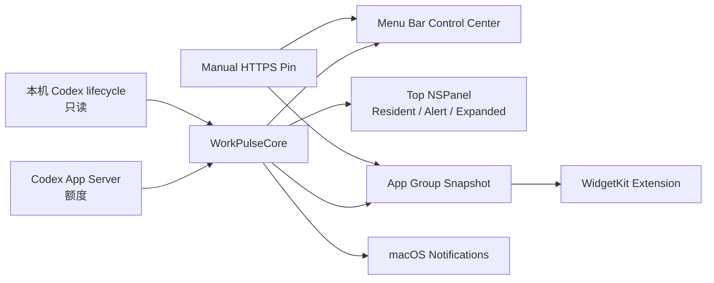

# 🚧 作者仍在开发中

> **WorkPulse 仍处于开发阶段，当前已暂停继续开发。** 本仓库保存的是可复现的开发快照，不是正式发布版本，也不提供可直接面向公众分发的安装包。

# WorkPulse

WorkPulse 是一款面向 macOS 的本地 ChatGPT / Codex 伴生应用。它不创建传统 Dashboard，而是把高频、需要扫一眼即可判断的信息放到 Mac 原生表面中：菜单栏控制中心、刘海附近的顶部状态层、桌面 Widget 和系统通知。

产品的核心问题很简单：**我还剩多少 Codex 额度，什么时候重置，以及当前有几个任务正在运行？**


## 产品定位

WorkPulse 不是 ChatGPT 或 OpenAI 的官方产品，也不是 API Usage 仪表盘。它是一个 local-first 的个人效率原型，读取本机 Codex 可用的额度状态和任务生命周期，并以适合 macOS 的轻量表面呈现。

它刻意避免成为另一个需要常驻打开的窗口：

- 顶部 **Resident** 始终优先显示额度窗口、剩余百分比和重置时间。
- 运行任务只以次级圆点和数量存在，不抢占额度主信息。
- 点击或主动展开后，才显示全部额度窗口和匿名任务详情。
- 菜单栏是控制中心与恢复入口，不是独立 Dashboard。
- 桌面 Widget 用于持续查看，系统通知只用于真正需要打断用户的阈值或任务终态。


## 已实现的产品表面

### 1. 顶部状态层

使用 AppKit `NSPanel` 实现三种状态：

- **Resident**：长期常驻，显示窗口身份、剩余额度、重置时间和运行任务数。
- **Alert**：一次性提醒，鼠标悬停、键盘、VoiceOver 或 Switch Control 交互时暂停收回。
- **Expanded**：用户主动展开，查看全部额度窗口、任务状态、数据来源和刷新动作。

带物理刘海的内建显示器会优先承载顶部状态层；没有刘海时降级为顶部胶囊。这个实现是 WorkPulse 自绘的 macOS 浮层，**不是 Apple 提供的第三方 Dynamic Island API**。

### 2. macOS 桌面 Widget

WidgetKit extension 已包含：

- Small Quota：剩余额度与重置时间。
- Small Pinned：打开用户固定的 ChatGPT HTTPS 对话入口。
- Medium Quick View：额度、运行任务计数和固定入口的组合。
- Large Today Overview：已支持数据的较大摘要，不伪造 Daily Brief、Gmail 或 Scheduled 状态。

Widget 与 Host 通过团队作用域 App Group 共享 schema 6 快照。快照具备原子写入、revision、fresh/stale 边界、损坏文件隔离与自愈，以及启动期间保留上一份可信额度的机制。

### 3. 菜单栏控制中心

控制中心包含五组主要设置：

- 当前额度与手动刷新
- 顶部常驻、一次性提醒和系统通知
- Privacy Mode 与任务名称显示授权
- Light、Dark、跟随系统和强调色
- 固定 ChatGPT 对话入口与登录时启动

Privacy Mode 默认开启。桌面 Widget 永远使用通用标题，不写入用户自定义任务名；系统任务通知也保持 generic copy，具体结果只在用户返回 WorkPulse 后按本机隐私偏好显示。

### 4. 系统通知

通知支持额度阈值和明确任务终态，具有周期去重、generic 文案、deep link 和本机 click receipt。Notification Center 的调度与 delivered transport 已验证；最后一轮开发暂停前，最新构建的真实通知点击/冷启动回流仍属于未完成的人工验收项。

### 5. 手动固定入口

用户可以保存一个有效的 HTTPS ChatGPT 对话链接，作为桌面 Widget 和控制中心的快捷入口。WorkPulse 不读取该对话正文，也不会把手动入口描述成 Gmail、Scheduled 或 Daily Brief 的自动同步。

## 当前状态

| 能力 | 当前状态 |
|---|---|
| 菜单栏控制中心 | 已实现并通过源码与本机运行检查 |
| 顶部 Resident / Alert / Expanded | 已实现；额度优先、悬停保护、隐私与多屏策略已验证 |
| WidgetKit Extension | 已实现并完成团队签名、本机注册与共享快照验证 |
| 真实额度读取 | 已实现；本机探针可读取多个 Codex quota bucket |
| Codex 运行任务 | 已实现本机只读生命周期监测；依赖内部本地 schema，未来版本可能漂移 |
| 系统通知 | 调度与 delivered 已验证；最新构建的 click/open 最终人工 Gate 未完成 |
| Gmail / Scheduled 自动状态 | 未实现；当前仅支持 Manual Pin |
| 公共安装包 | 未提供；缺少 Developer ID、notarization、更新与支持链 |
| 开发状态 | **暂停开发，保留完整源码快照** |
| 作者本机安装 | 已按暂停开发决定终止并卸载；应用与本机数据仅保留在可恢复废纸篓备份中 |

最后一次冻结前，`WorkPulseCoreVerify` 通过 260 项检查，Widget source type-check、系统表面 verifier、Xcode Release build、Host/Widget strict codesign、单实例与唯一 PlugInKit 注册均通过。详细边界见 [最终验收记录](reviews/final_acceptance_v23_2026-08-13.md) 和 [最终 PRD](PRD_V5_FINAL.md)。

## 隐私与数据边界

WorkPulse 采用 local-first 设计：

- 不上传 prompt、对话正文、Gmail 正文或本机文件内容。
- 额度读取只访问本机 Codex App Server。
- 任务监测只读本机 Codex 生命周期数据，不混入内部子智能体任务。
- Widget 不保存用户自定义入口名称或对话 URL。
- Privacy Mode 会覆盖任务名显示授权，并清理本机缓存的名称。
- QA fixture 不允许外发到 Widget 或生产通知。

本仓库不包含作者的本机偏好、ChatGPT 对话链接、Apple 签名证书、Personal Team 标识或已签名开发包。

## 架构



## 仓库结构

```text
.
├── README.md                         产品概览与开发状态
├── PRD_V5_FINAL.md                   当前产品需求文档
├── DESIGN_RESEARCH.md                竞品、需求与形态研究
├── workpulse_mac_desktop_demo.html   Mac 桌面交互 Demo
├── assets/                           Demo 视觉资源
├── native/WorkPulseNative/
│   ├── Sources/                      Swift Host 与 Core
│   ├── WidgetExtension/              WidgetKit Extension
│   ├── Xcode/                        Info.plist 与 entitlement 模板
│   ├── WorkPulse.xcodeproj/          正式 Xcode 工程
│   ├── Package.swift                 SwiftPM 工程与验证工具
│   └── scripts/                      构建、安装、验收与卸载脚本
└── reviews/                          产品、技术、UI/UX 与质疑审查记录
```

## 开发环境

- macOS 14+
- Swift 6
- 完整 Xcode，用于 Host + Widget Extension 团队签名
- Apple Development Team，用于让 Widget 稳定进入本机组件库

最终用户安装一个未来经过 Developer ID 签名与 notarization 的成品时不应需要 Xcode；当前仓库尚未提供这种公开发行版本。

## 构建与验证

```bash
cd native/WorkPulseNative

swift build
swift run WorkPulseCoreVerify
./scripts/typecheck_widget.sh
./scripts/verify_system_surfaces.sh
```

生成团队签名的本机开发包：

```bash
./scripts/build_full_product.sh
./scripts/install_signed_product.sh
./scripts/verify_widget_runtime.sh
```

卸载本机开发版：

```bash
./scripts/uninstall_local.sh
```

卸载脚本会终止 Host/Widget、注销系统扩展，并把应用和本机数据移到废纸篓中的时间戳目录，避免直接永久删除。

## 已知限制

- Codex App Server 与本机任务数据库属于实验性集成边界，版本升级可能导致 schema 漂移。
- WidgetKit 的刷新频率由 macOS 调度，不能承诺秒级实时更新。
- 系统通知是否显示横幅或声音还受 Focus 和系统通知策略控制。
- 当前没有正式 Gmail、Scheduled、Needs You 或跨客户端 ownership adapter。
- 当前没有 Developer ID、notarization、自动更新、购买恢复或正式支持渠道。
- Medium/Large Widget 已实现支持数据组合，但首发价值尚未完成长期 diary 验证。

## 开发与发布说明

本仓库由 [@thejaytang](https://github.com/thejaytang) 维护。项目目前暂停继续开发，保留此快照用于未来恢复、审查和迭代。

当前未选择开源许可证。除非仓库后续明确添加许可证，否则代码不自动授予复制、修改或再分发许可。
