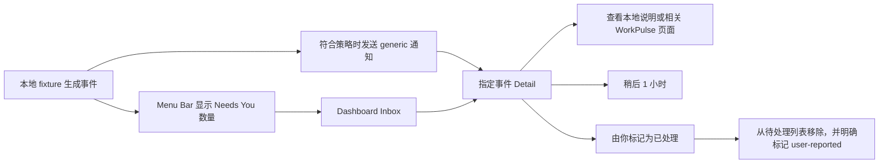

# WorkPulse V7 · 最小 Needs You Inbox / Detail 交互规格

> 目标：在当前 Native Shell 内形成可测试的 Needs You 闭环，不依赖刘海、真实 source、真实审批 API 或精确上下文返回。  
> 范围：Menu Bar、Dashboard Inbox / Detail、macOS 通知 fallback。  
> 核心原则：WorkPulse 可以提醒、解释、导航和记录用户处置，但不能代替来源做审批，也不能把“已看”“已打开”或“从列表隐藏”表达成来源已解决。

## 1. 最小产品闭环

P0 不实现：在 WorkPulse 内批准/拒绝、提交输入、重试来源任务、保证跳回原对话、刘海 Resident/Alert/Expanded、自动判定 source resolved。

## 2. Event presentation contract

所有表面消费同一个 `EventPresentation`，禁止各自拼接标题或 CTA。

建议最小字段：

| 字段 | 用途 | 约束 |
|---|---|---|
| `eventID` | 去重和 deep link | 本机稳定 UUID |
| `type` | 决定图标、generic copy、CTA | 使用现有 `WorkEventType` |
| `createdAt` | 排序与相对时间 | 不显示伪造更新时间 |
| `disposition` | `unread` / `seenPending` / `snoozed` / `userHandled` | `userHandled` 不等于 source resolved |
| `freshness` | `fresh` / `cached` / `stale` / `offline` / `sourceConflict` | stale/conflict 禁止显示绿色 |
| `genericTitle` | Menu、通知和 Privacy | 必填，不含项目或对话名称 |
| `approvedTitle` | 应用内可选标题 | 仅 Privacy off 且用户授权时显示 |
| `summary` | Detail 本地说明 | fixture 必须标“模拟事件” |
| `targetURL` | 可选系统导航 | 只接受有效 HTTPS；打开不等于到达 |

状态语义：

- 打开 Inbox：不改变事件是否解决，只可将 `unread` 改为 `seenPending`。
- 打开 Detail：保持 `seenPending`，列表仍计入 Needs You。
- “稍后 1 小时”：变为 `snoozed`；倒计时结束后回到 pending，不创建第二条事件。
- “由你标记为已处理”：变为 `userHandled` 并移出默认 Inbox；历史中显示“由你标记，来源未验证”。
- 将来接入真实 source 后，只有 source 明确确认 resolved 才可显示“来源已解决”。

## 3. Event-specific CTA

### 3.1 CTA 映射

| Event type | Generic 标题 | Inbox row CTA | Detail primary CTA | Secondary | 图标 |
|---|---|---|---|---|---|
| `needsApproval` | 需要你的确认 | 查看请求 | 查看请求范围 | 稍后 1 小时 | `checkmark.shield` |
| `needsInput` | 需要补充信息 | 查看所需信息 | 查看所需信息 | 稍后 1 小时 | `text.bubble` |
| `workLossRiskFailure` | 任务可能无法继续 | 查看恢复选项 | 查看恢复步骤 | 稍后 1 小时 | `exclamationmark.triangle` |
| `quotaPaused` | 任务因额度暂停 | 查看额度 | 查看额度详情 | 稍后 1 小时 | `gauge.with.dots.needle.50percent` |
| `recoverableFailure` | 一项任务需要检查 | 查看诊断 | 查看诊断说明 | 从 Inbox 隐藏 | `wrench.and.screwdriver` |
| `longTaskCompleted` | 一个长任务已完成 | 查看结果入口 | 查看结果入口 | 从 Inbox 隐藏 | `checkmark.circle` |
| `sourceDisconnected` | 一个来源已断开 | 检查连接 | 检查连接状态 | 从 Inbox 隐藏 | `bolt.slash` |

`quotaCritical` 在现有 `DeliveryPolicy` 中只进入 Widget，不进入 Needs You Inbox；P0 不改变该归属。

### 3.2 CTA 行为边界

- Inbox row CTA 永远只打开 WorkPulse Detail，因此无真实 source 也可完整测试。
- Detail primary 先打开 WorkPulse 内的对应 section，例如请求范围、所需信息、恢复步骤、额度详情或连接诊断。
- 如果存在有效 `targetURL`，Detail 可额外显示低一层级的“交给系统打开”；点击反馈固定为“已发送打开请求，尚未确认到达对应上下文”。
- 无有效 URL 时不渲染外部打开按钮；不可用状态以说明文字取代，不保留一个必然失败的高强调 CTA。
- “由你标记为已处理”放在 `…` 菜单或 Detail 底部，执行前确认：“这只会从 WorkPulse 待处理列表移除，不会在来源中批准、提交或重试。”

## 4. Menu Bar 规格

沿用现有 390pt popover，不在菜单栏内塞入完整 Detail。

### 4.1 Header

- 左侧：WorkPulse 图标与“Needs You”。
- 右侧：数量 badge；0 时隐藏 badge，显示中性 `checkmark.circle` 与“当前安静”。
- 数量只计算 `unread + seenPending`；`snoozed` 在到期前不计数；`userHandled` 永不计数。
- Menu Bar app icon 不以颜色作为唯一状态；VoiceOver summary 示例：“WorkPulse，2 项需要处理，其中 1 项未读”。

### 4.2 Event preview

- 最多显示 3 条，高度至少 56pt；按 `severity` 后 `createdAt` 排序。
- 每行结构：状态图标、generic/approved 标题、event type + 相对时间、chevron。
- 点击整行或按 Return 打开指定 Detail；点击不从计数中移除，只将 unread 改为 seen。
- 超过 3 条时底部显示“查看全部 5 项”；没有事件时显示空态，不显示空白列表。
- popover 底部保留 Privacy 与 Settings；Needs You 列表位于 routine 和 quota 之前，只有计数大于 0 才提升到第一段。

### 4.3 Keyboard

- 打开 popover 后，Tab 在事件行、查看全部、Privacy、Settings 间移动。
- 上/下箭头可在事件行间移动；Return 打开；Escape 关闭 popover。
- 全局菜单项提供“打开 Needs You Inbox”，建议快捷键 `⌘⇧I`。

## 5. Dashboard Inbox / Detail 规格

在现有 760 × 520 WindowGroup 中采用双栏，不创建新窗口：

- Inbox sidebar：240pt，可调整到 220–280pt。
- Detail：剩余宽度，最小 420pt。
- 窗口小于 660pt 时切为单栏 push navigation：Inbox → Detail，Toolbar 提供返回。

### 5.1 Inbox row

信息优先级：

1. 状态图标 + generic/approved title；
2. event type 的自然语言，例如“需要确认”“需要输入”“连接断开”；
3. 相对时间和 freshness；
4. unread 小圆点仅作为补充，必须同时有“未读”accessibility value。

选中态使用系统 accent background；严重度只影响图标，不用整行红色或橙色。

### 5.2 Detail

从上到下固定为：

1. Eyebrow：`模拟事件` / `未连接真实来源`；
2. 标题与状态，例如“需要你的确认”“已看，尚未处理”；
3. 发生时间、freshness、来源可用性；
4. event-specific explanation；
5. event-specific section；
6. primary CTA、稍后、更多菜单；
7. 边界说明：“WorkPulse 不会代替来源执行批准、提交或重试。”

Detail 不显示无法被 fixture 支持的项目名、文件名、prompt 或来源健康结论。

### 5.3 Selection 与 deep link

- `workpulse://inbox`：激活主窗口并聚焦 Inbox；有事件时选中排序第一项，无事件时显示空态。
- `workpulse://event/{UUID}`：先验证本机事件是否存在，再激活并选中对应 Detail。
- 事件不存在：显示内联状态“这条提醒已不存在或已被移除”，提供“返回 Needs You”，不显示成功反馈。
- 通知点击和 Menu Bar 行点击必须走同一 deep-link handler，避免出现两套导航逻辑。

## 6. 通知 fallback

P0 通知仅在 `DeliveryPolicy` 选择 notification 时发送；不依赖 Notch，也不与其他主动表面重复。

### 6.1 Generic notification copy

| Event type | Title | Body | Primary action |
|---|---|---|---|
| `needsApproval` | ChatGPT 需要你的确认 | 一个任务正在等待你查看。 | 查看请求 |
| `needsInput` | ChatGPT 需要补充信息 | 一个任务需要你的输入才能继续。 | 查看所需信息 |
| `workLossRiskFailure` | 任务可能无法继续 | WorkPulse 保存了一条恢复提示。 | 查看恢复选项 |
| `quotaPaused` | 一个任务因额度暂停 | 打开 WorkPulse 查看额度状态。 | 查看额度 |
| `longTaskCompleted` | 一个长任务已完成 | 打开 WorkPulse 查看结果入口。 | 查看结果 |

通知不发送 `approvedTitle`、项目名、对话名、文件名或 Gmail 单位。Primary action 统一 deep link 到对应 Event Detail；按钮文案 event-specific，但动作仍只是“打开 WorkPulse Detail”。

### 6.2 Secondary action 与去重

- Secondary action：“稍后 1 小时”。执行后事件进入 snoozed，通知消失，事件仍可在“已稍后”筛选中找到。
- `threadIdentifier = eventID`，同一事件更新原通知，不叠加新通知。
- 通知送达、点击或关闭均不等于 resolved；只有“稍后”改变 snooze，Primary 只改变 seen 状态。
- App 在前台时不发通知；通知权限拒绝时只保留 Menu Bar badge + Inbox，不持续弹权限请求。

## 7. 空态、断连、stale 与冲突态

| 状态 | Inbox | Detail | 可用操作 |
|---|---|---|---|
| Empty | `checkmark.circle` + “暂时没有需要处理” + “新的提醒会保留在这里” | 不显示空白 Detail | 返回 Dashboard |
| Loading >150ms | 3 条稳定 skeleton，不闪烁数字 | 标题与两段 skeleton | 无 |
| Offline | 顶部中性 banner：“当前离线，显示本机记录” | 保留本地详情，freshness 为“离线” | 稍后、用户标记；外部打开取决于本地 URL |
| Source disconnected | 作为一条独立 Needs You event | 显示最后成功观察时间，不显示 healthy | 检查连接状态 |
| Stale | 列表 badge“可能已过期”，不主动发新通知 | 说明“操作前请在来源确认” | 查看说明、交给系统打开（若有 URL） |
| Source conflict | 顶部琥珀 banner：“来源状态不一致” | 并列显示“WorkPulse 上次记录”和“当前来源报告”，不自动选一方 | 在来源确认、查看诊断 |
| Unknown event | 不插入 Inbox | “无法识别此事件类型” | 返回 Needs You、查看诊断 |

Conflict 禁止提供“批准”“提交”“重试”或“来源已解决”；用户只能导航或将事件标记为 WorkPulse 本地已处理。

## 8. Accessibility contract

- 每个事件行合并为一个可访问元素。朗读顺序：标题、类型、处置状态、freshness、相对时间、操作提示。
- 示例：“ChatGPT 需要你的确认，需要确认，未读，模拟事件，2 分钟前，按 Return 查看请求。”
- event type 使用 SF Symbol + 文字；freshness 使用图标 + 文字；unread 使用文字 value，不能只有小圆点。
- Dynamic Type/更大文本下，row 最多扩展到 3 行，不截断 CTA；Dashboard 必须支持垂直滚动。
- `Increase Contrast` 下使用系统 separator 与 accent selection，不依赖半透明卡片区分层级。
- `Differentiate Without Color` 下，warning/conflict 使用 `exclamationmark.triangle`，offline 使用 `wifi.slash`，handled 使用 `person.crop.circle.badge.checkmark`。
- 状态变化通过 `AccessibilityNotification.Announcement` 宣告，例如“已稍后 1 小时，提醒仍保留在 Needs You”。
- destructive-looking 的“从 Inbox 隐藏”必须有确认和明确后果；默认焦点永远不落在该操作。

## 9. 最小 fixture 集

Native Shell 内置只读的“模拟 Needs You”开关，持续显示“模拟事件 · 非实时数据”。建议 6 条确定性 fixture：

1. `needsApproval` + unread + fresh；
2. `needsInput` + seenPending + fresh；
3. `workLossRiskFailure` + snoozed；
4. `quotaPaused` + stale；
5. `sourceDisconnected` + offline；
6. `needsApproval` + sourceConflict。

Fixture ID 固定，便于 deep link、通知去重、截图与 UI test；关闭模拟开关后必须清除 fixture 通知和 badge，不写入 Widget snapshot。

## 10. P0 acceptance criteria

- **AC-EVENT-01**：Menu Bar、Inbox、Detail 和通知对同一 `eventID` 显示相同 event type、处置状态与 freshness。
- **AC-EVENT-02**：七种 Inbox event type 均使用表中对应 CTA，不出现所有事件统一叫“审批”的情况。
- **AC-EVENT-03**：打开 Inbox、Detail 或通知 Primary 后，事件仍为 pending；badge 只减少 unread，不减少 unresolved 数量。
- **AC-EVENT-04**：“稍后 1 小时”不会删除事件；到期后同一 `eventID` 恢复，不生成重复通知。
- **AC-EVENT-05**：“由你标记为已处理”经确认后移出默认 Inbox，历史明确显示 user-reported，绝不显示 source resolved。
- **AC-EVENT-06**：无 target URL 时不显示外部打开 CTA；有 URL 时反馈不承诺 exact return。
- **AC-EVENT-07**：Empty、offline、sourceDisconnected、stale、sourceConflict、unknown event 均有文字、图标和可执行 fallback，无空白 Detail。
- **AC-EVENT-08**：Privacy 开启后，四个表面一秒内切换为 generic title/copy，通知始终 generic。
- **AC-EVENT-09**：VoiceOver 可完成“打开 Inbox → 选择事件 → 查看 Detail → 稍后 → 返回”的完整流程，且无需颜色判断状态。
- **AC-EVENT-10**：同一事件在通知、Menu Bar 和 Inbox 中只存在一个 delivery identity；通知点击准确打开本机对应 Detail，未知/已移除 ID 显示真实错误态。

## 11. P1 延后项

- 真实 source adapter 与 source-resolved 自动闭环；
- WorkPulse 内 inline approval/input；
- 跨设备事件同步；
- Notch Resident/Alert/Expanded；
- 事件搜索、高级筛选、批量处理；
- 多 source 优先级与自动 conflict resolution。

