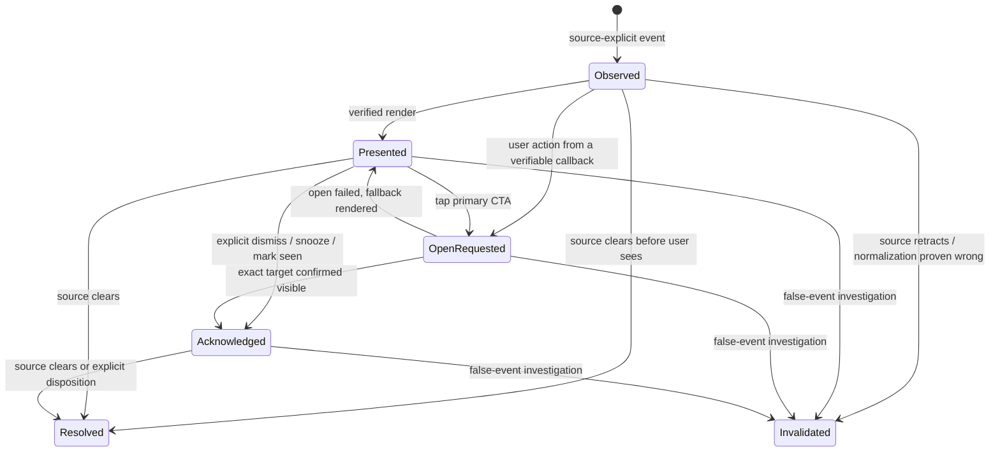

# WorkPulse V7 Needs You 事件状态机与 Truth-safe Acceptance Criteria

> 日期：2026-08-11  
> 范围：`needsApproval`、`needsInput`、`workLossRiskFailure`、`quotaPaused`  
> 目标：定义最小用户状态机、证据合同、事件特定 CTA、false alert / wrong-target safety stop  
> 本文是产品与研究验收规范，不代表当前实现已具备这些能力。

## 0. 核心原则

Needs You 不是“通知是否发出”的列表，而是一个有来源证据、投放证据、导航证据和解决证据的 attention ledger。

以下五个概念必须独立：

1. **Observed**：WorkPulse 从已验证 source 观测到一个需要行动的事件。
2. **Presented**：某个 WorkPulse 表面确实完成渲染或可验证呈现。
3. **Open-requested**：用户要求系统打开目标；只证明请求发生。
4. **Acknowledged**：有证据表明用户已看见事件；不代表问题解决。
5. **Resolved**：来源问题已经解除，或用户明确作出不声称来源恢复的处置。

禁止等价关系：

```text
observed ≠ presented
presented ≠ acknowledged
open-requested ≠ open-confirmed
open-requested ≠ acknowledged
acknowledged ≠ resolved
reset time reached ≠ quota pause resolved
source disconnected ≠ task failed
```

## 1. 最小状态模型

### 1.1 为什么不是严格直线

macOS 可能接受 notification request，但 Focus 或系统策略会阻止用户看到它。应用不能因此写 `presented`。相反，用户点击 notification action 时，可以直接证明用户已看见，即使应用无法取得先前的实际呈现回执。

因此状态应由独立 evidence fields 派生，而不是通过一个可被随意推进的 enum 保存。

### 1.2 必要 evidence fields

```text
work_event_id
source_id
source_instance_id
source_event_id
normalized_type
source_observed_at
source_occurred_at?
source_freshness
source_evidence_class
dedupe_key

presented_at?
presented_surface?
presentation_evidence?

open_requested_at?
open_target_id?
open_target_quality
open_request_result?
open_confirmed_exact_at?
open_failure_class?

acknowledged_at?
acknowledgement_method?

resolved_at?
resolution_kind?
resolution_evidence?

snoozed_until?
muted_scope?
active_owner?
invalidated_at?
invalidation_reason?
```

所有 ID 为非内容标识；不得包含 prompt、标题、URL、路径、命令或 Gmail 数据。

### 1.3 派生的用户状态

状态按以下优先级派生：

```text
if invalidated_at exists     → INVALIDATED
else if resolved_at exists   → RESOLVED
else if acknowledged_at      → ACKNOWLEDGED_UNRESOLVED
else if open_requested_at    → OPEN_REQUESTED_UNCONFIRMED
else if presented_at         → PRESENTED_UNACKNOWLEDGED
else                         → OBSERVED_UNPRESENTED
```

`snoozed`、`muted`、`active_owner` 是修饰符，不改变 truth state。一个 snoozed 事件仍可能 unresolved。

### 1.4 状态图



`Resolved` 与 `Invalidated` 都是 terminal，但语义不同：Resolved 表示事件曾真实存在并被解除；Invalidated 表示不应继续把它当作有效事件。

## 2. 每个阶段的证据合同

### 2.1 Observed

允许进入条件：

- source capability 为 `live_verified`。
- 事件由 machine-readable source-explicit signal 支持。
- source freshness 为 `fresh`。
- source ID、source event ID 或可稳定重建的 dedupe key 存在。
- normalized type 属于四种 P0 Needs You。

不得进入：

- 只因自然语言内容看起来像提问或失败。
- 只因任务沉默、App Server 断开或 thread 为 `notLoaded`。
- 只因 quota 百分比低、reset 时间到达或 quota critical。
- 从历史日志重放但无法证明当前仍 pending。

文案：

- Inbox 可写“来源报告一项任务需要处理”。
- 尚未投放时不能写“已提醒”。

### 2.2 Presented

允许进入条件：

- Native Alert / MenuBar / app row 已完成实际 render；或
- 存在平台提供的可靠 presentation callback。

以下不算 Presented：

- `UNUserNotificationCenter.add` completion success。
- delivery policy 选择了 surface。
- Widget timeline 已排程但未确认加载。
- Overlay 准备显示但 window 未 visible。

System notification 应先记录 `delivery_handoff_accepted`。若平台不能证明用户侧呈现，`presented_at` 保持 nil；用户点击 action 时可直接形成 acknowledgement evidence。

Presented 只表示“表面出现过”，不等于用户注意到。

### 2.3 Open-requested

允许进入条件：

- 用户点击事件 CTA、Widget link、Notification action 或键盘激活目标。
- 记录 target ID、target quality、origin surface 和 request timestamp。

文案：

- `verifiedExact` target：`正在打开对应任务…`。
- manual / unverified：`已发送打开请求；尚未确认是否到达对应任务。`

以下不能自动发生：

- 不能因为 `NSWorkspace.open` accepted 写 `acknowledged`。
- 不能写 `resolved`。
- 不能改变 source truth。

### 2.4 Acknowledged

可接受证据：

- 用户在已呈现表面点击“已看”或显式关闭。
- 用户点击 snooze / later。该动作证明已看，但事件仍 unresolved。
- notification action callback。
- `verifiedExact` confirmation 证明正确目标已在用户前台可见。
- 用户打开 WorkPulse event detail 且该 row 实际呈现。

不可接受证据：

- Alert 自动超时收回。
- Notification request 被系统接受。
- App 被激活，但没有显示对应 event。
- 打开外部 URL 返回 accepted。
- hover、Resident badge 更新或 Widget timeline reload。

Acknowledged UI：

- `已看 · 尚未解决`。
- acknowledged event 可降低主动打扰，但必须保留在 unresolved Inbox，除非 snoozed / muted。

### 2.5 Resolved

优先使用 source-explicit resolution：

- approval request 已响应且 source 不再 pending。
- requested input 已被 source 接收，turn 恢复或进入新状态。
- quota-paused turn 已恢复、取消或进入明确 terminal state。
- work-loss-risk failure 被成功 retry / superseding turn 明确替代。

允许 user disposition，但必须另标语义：

- 用户选择“无需继续处理 / 从 Needs You 移除”。
- `resolution_kind = user_disposition`。
- 文案为“已从 Needs You 移除；原任务状态未被 WorkPulse 改变”。

禁止把以下操作写为 source resolved：

- 打开事件。
- acknowledged。
- dismiss / auto-close。
- 到达 reset 时间。
- 重新连接 source，但未观察到受阻 turn 恢复。
- 用户关闭 WorkPulse 通知。

## 3. 四种 P0 事件的 Truth-safe 合同

### 3.1 Approval

Source evidence：

- explicit approval request method / item。
- request ID 与 thread / turn / item target 可关联。
- request 仍 pending。

Presentation copy：

- 标题：`有一项 Codex 任务需要确认`。
- CTA：`处理审批`。
- 禁止在 generic surface 显示命令、路径或 thread title。

Resolved evidence：

- source 接受 approve / deny / cancel response；或
- source 明确报告 request 不再 pending。

Acceptance：

- controlled approval recall = 100%。
- false approval active alert = 0。
- reconnect historical replay = 0。
- CTA 只能指向该 approval，不能只打开 thread 首页并称 exact。

### 3.2 Needs input

Source evidence：

- explicit structured user-input request。
- 仅模型回复中出现问号或“请提供”文本不够。

Presentation copy：

- 标题：`有一项 Codex 任务需要补充信息`。
- CTA：`补充输入`。

Resolved evidence：

- source 接受 input 并离开 waiting-input；或
- turn 被用户明确取消。

Acceptance：

- 不得把 approval 映射成 input，反之亦然。
- 打开输入框不算 resolved；input submission accepted 后才可 resolved。

### 3.3 Work-loss-risk failure

Source evidence：

- explicit terminal / fatal failure；且
- source error class、operation class 或受控规则证明存在 work-loss / destructive side-effect risk。

不满足第二条时只能归为 `recoverableFailure`，保持被动，不得升级成 work-loss-risk。

Presentation copy：

- 有充分证据：`Codex 报告一项高风险失败，需要检查`。
- 只有 terminal failure：`Codex 报告一项任务失败`，不能写“工作已丢失”。
- CTA：`查看失败`。

Resolved evidence：

- successful retry / superseding turn；或
- user disposition 明确移除，但保留“原任务仍为失败”的说明。

Acceptance：

- controlled work-loss-risk recall = 100%。
- 将普通 recoverable failure 升为 work-loss risk = 0。
- 未有 artifact-loss evidence 时禁止使用“工作丢失 / 文件损坏”等 copy。

### 3.4 Quota paused

Source evidence：

- 某个具体 turn 明确被 quota / rate limit 阻塞或暂停。
- 必须能关联到受阻 target。

不构成 Quota paused：

- quota remaining 较低。
- quota critical / exhausted dashboard state。
- reset 倒计时。
- 用户因为额度焦虑主动暂停工作。

Presentation copy：

- 标题：`有一项 Codex 任务因额度暂停`。
- CTA：`查看受阻任务与额度`。

Resolved evidence：

- source 报告 turn 恢复、取消或明确 terminal。
- reset time 到达只能触发重新读取，不能直接 resolved。

Acceptance：

- generic quota critical 产生 Needs You = 0。
- cached / stale quota 产生 quota-paused alert = 0。
- quota-paused CTA 打开错误 turn = safety stop。

## 4. Delivery ownership、去重与修饰状态

### 4.1 单一主动 owner

同一个 `work_event_id` 的一个 unresolved cycle 最多有一个 active owner：

- Overlay 可达且 source 非前台：Overlay。
- Overlay 不可达、通知已授权：Notification handoff。
- 其他情况：不主动投放，只保留 MenuBar / Inbox。

MenuBar badge、Inbox row 和 Widget 被动状态不算第二个 active owner。

### 4.2 Dedupe identity

推荐 key：

```text
source_instance_id
thread_id
turn_id
item_or_request_id
normalized_type
transition
```

Reconnect / reconcile 不得重建新的用户事件 ID。只有 source 明确产生新的 request / blocking cycle 才建立新 event。

### 4.3 Snooze / mute / dismiss

- Snooze：可 acknowledged，仍 unresolved；到期前不重新 active delivery。
- Mute：只改变 delivery eligibility，不改变 observed / resolved。
- 显式 dismiss：默认 acknowledged；若用户选择“从 Needs You 移除”，记录 user disposition，不写 source recovered。
- Alert auto-collapse：不 acknowledged。

## 5. False alert 定义

### 5.1 False active alert

满足任一即为 false active alert：

1. presentation 时没有对应的 valid fresh observed event。
2. normalized type 与 source evidence 不符。
3. 事件已 resolved / invalidated，仍主动呈现。
4. reconnect 把历史 pending / completion 当新事件重放。
5. stale、cached、offline、unsupported、notLoaded 或 sourceConflict 触发主动提醒。
6. 同一 unresolved cycle 被两个 active surfaces 重复呈现。
7. 普通 quota critical 被呈现为 quota paused。
8. recoverable failure 被无依据升级为 work-loss risk。

不算 false alert：

- 事件真实存在，但用户觉得时机不合适。该项归入 unhelpful / mistimed alert。
- source 在呈现后立即自行 resolved。保留真实 observed / presented，随后 resolved。

### 5.2 指标

- **False active alert rate** = false active alerts ÷ active alerts。
- controlled high-risk false alert count 必须为 0。
- diary false active alert rate 目标为 0；任何 confirmed high-risk false alert 直接触发 safety stop，不等待比例达到阈值。

## 6. Wrong target 定义

### 6.1 Wrong-target incident

满足任一即为 wrong target：

- CTA 标为 exact，却打开了错误 thread、turn、item、approval、account 或 workspace。
- Approval CTA 只打开 thread 首页，但 UI 写“已打开审批”。
- target 已失效，系统打开相邻或最近 thread，WorkPulse 仍记 exact success。
- source event 与 open target 的 event / request ID 不一致。

不算 wrong target，但必须 fallback：

- manual URL 被系统拒绝。
- unverified target 只写“打开链接”且没有 exact claim。
- exact confirmation 超时，UI 写“未能确认”，随后进入 WorkPulse detail。

### 6.2 Target quality

```text
verifiedExact   // 可做 event-specific CTA
verifiedThread  // 只承诺进入正确 thread，不承诺 item
manualURL       // 只承诺交给系统打开
workpulseDetail // 安全本地 fallback
unsupported
```

任何 target quality 降级都必须同步改变 CTA 和 success copy。

## 7. Safety Stop

### 7.1 自动触发条件

以下任一 confirmed incident 立即触发，不等待统计显著性：

- 1 个 false approval active alert。
- 1 个 false work-loss-risk active alert。
- 1 个 wrong `verifiedExact` target。
- 1 个 privacy exposure on Widget / Notification / Alert。
- source disconnected 被标成 task failure。
- stale / historical event 被作为新的 high-risk active alert 投放。

### 7.2 Stop scope

| Incident | 立即动作 |
|---|---|
| false event type | 停止该 source + normalized type 的 active delivery；保留 generic monitoring-unavailable state |
| wrong exact target | 禁用该 source / target class 的 direct open；全部降级到 `workpulseDetail` |
| duplicate active owner | 关闭次级 active surface，保留持久 Inbox；冻结 delivery ledger 诊断数据 |
| privacy exposure | 关闭所有 external active surfaces；强制 generic；停止 Pilot 数据导出 |
| schema / version incompatibility | 停止 source adapter，标 unsupported；不自动重试制造提醒 |

Safety stop 不能删除事件证据、静默改写为成功或自动归零错误计数。

### 7.3 恢复条件

只有同时满足以下条件才恢复相关 capability：

1. root cause 已定位。
2. 新 fixture / regression test 可稳定复现旧问题并通过修复。
3. 受影响 source + event type 的完整 controlled suite 重跑。
4. false high-risk = 0，wrong target = 0，privacy exposure = 0。
5. Pilot 负责人显式解除 feature flag；不能自动恢复。

## 8. Truth-safe Acceptance Criteria

### 8.1 跨事件硬标准

- **AC-E01**：每个 active alert 必须能追溯到 fresh、source-explicit observed event。
- **AC-E02**：approval 与 work-loss-risk controlled recall 均为 100%；四类 critical 总 recall ≥95%。
- **AC-E03**：false approval / work-loss-risk / quota-paused active alert 数量为 0。
- **AC-E04**：同 event unresolved cycle 的 active owner 最多 1 个；controlled duplicate 为 0。
- **AC-E05**：reconnect / wake / app restart 后历史 active replay 为 0。
- **AC-E06**：stale、cached、offline、unsupported、notLoaded、sourceConflict 产生 active alert 为 0。
- **AC-E07**：`surface_presented` 只在实际可验证 render 后记录；notification add accepted 不得冒充 presented。
- **AC-E08**：open request accepted 不自动 acknowledged；acknowledged 不自动 resolved。
- **AC-E09**：premature acknowledgement 与 premature resolution 均为 0。
- **AC-E10**：`verifiedExact` wrong-target 数量为 0；任一实例立即 safety stop。
- **AC-E11**：open failure 在 1 秒内显示 `workpulseDetail` fallback，不改变 source truth。
- **AC-E12**：Widget、Notification、Alert 默认内容中敏感标题、prompt、路径、命令和 Gmail 内容数量为 0。

### 8.2 事件特定标准

- **AC-A01**：Approval 只来自 explicit pending approval request，CTA 为“处理审批”。
- **AC-A02**：Approval resolved 只来自 source request cleared / response accepted，不来自打开或 dismiss。
- **AC-I01**：Needs input 只来自 structured input request，不能从自然语言问句推断。
- **AC-I02**：Input submission 被 source 接受后才 resolved。
- **AC-F01**：Work-loss-risk 必须有 terminal failure + risk evidence；否则降为 recoverable。
- **AC-F02**：没有 artifact-loss evidence 时 copy 不得写“工作已丢失 / 文件已损坏”。
- **AC-Q01**：Quota paused 必须关联具体 blocked turn；quota critical 本身不进入 Needs You。
- **AC-Q02**：reset time 到达只触发刷新，不直接 resolved。

### 8.3 Pilot 指标

- event-to-present latency：对已确认 live source，p95 ≤2 秒。
- safe fallback rate：100%。
- exact return rate：`verifiedExact` controlled = 100%，overall ≥95%。
- useful active alert rate：≥80%，但不能抵消任一 safety incident。
- participant median resolution-time improvement：≥30%。
- premature ack / resolve rate：0。
- confirmed wrong-target rate：0。

## 9. 最小测试场景

每种事件至少覆盖：

1. source 前台，active alert 应 suppress。
2. source 后台，Overlay owner。
3. Overlay 不可达，Notification handoff。
4. notification denied，只保留 MenuBar / Inbox。
5. event 在呈现前自行 resolved。
6. event 呈现后、用户打开前 resolved。
7. open accepted 但无法确认 exact。
8. open target 错误。
9. user snooze 后 source 仍 pending。
10. reconnect 重放相同 source event。
11. source disconnect。
12. freshness 在 delivery 前变 stale。

额外事件场景：

- Approval：approve、deny、cancel、request reissued。
- Input：提交成功、提交失败、turn cancel。
- Failure：recoverable vs work-loss-risk 分类边界、successful retry、user disposition。
- Quota paused：低额度但未受阻、明确 blocked、reset 到达但仍 blocked、turn resume。

## 10. 发布决策

Needs You 只有在以下条件同时满足时进入 10 天 Pilot：

- Gate A/B/C 通过。
- 本文件 AC-E01 至 AC-E12 与事件特定 AC 全部 controlled Pass。
- Safety stop feature flag 可用并经过触发测试。
- Ground truth 独立于 WorkPulse event pipeline。
- Pilot build 不包含可被误认成 live 的模拟事件。

如果 event observation 可靠但 exact return 未通过，可继续内部状态可见性研究；不能以“Needs You 行动闭环”进入 field Pilot。若 false high-risk alert 或 wrong target 不能做到零，Needs You 整体 No-Go，不应通过降低文案强度掩盖运行时不可信。
